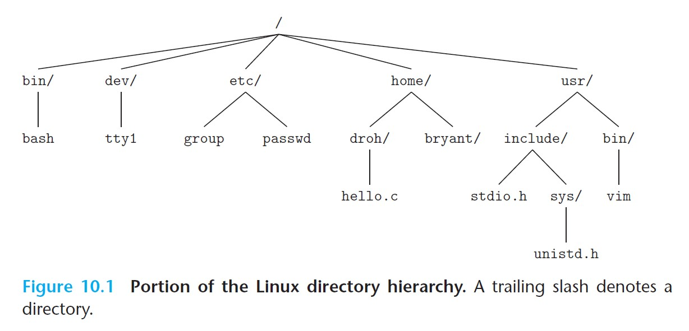
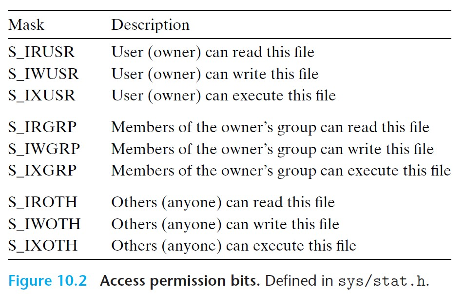
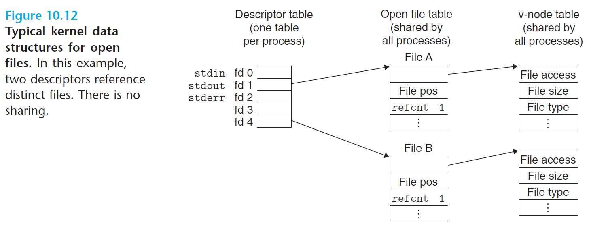
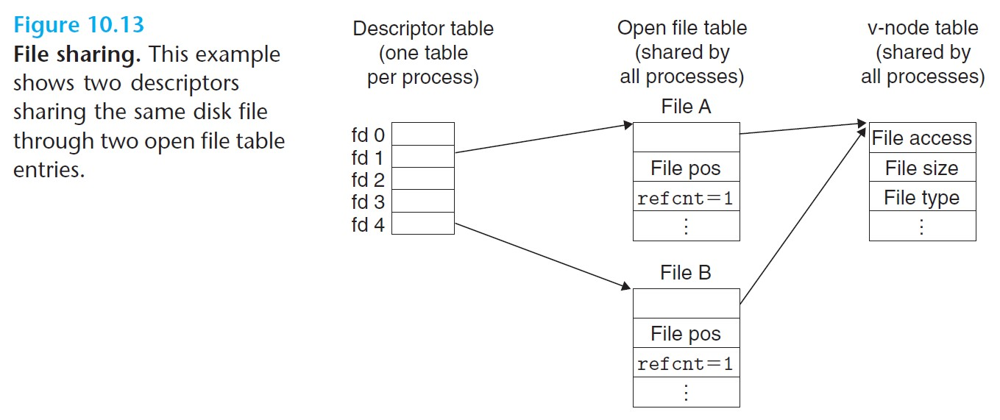
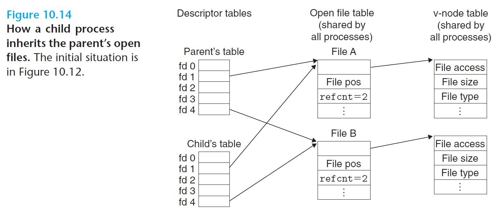
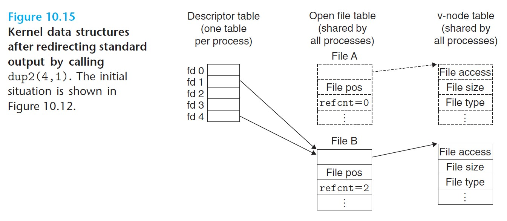
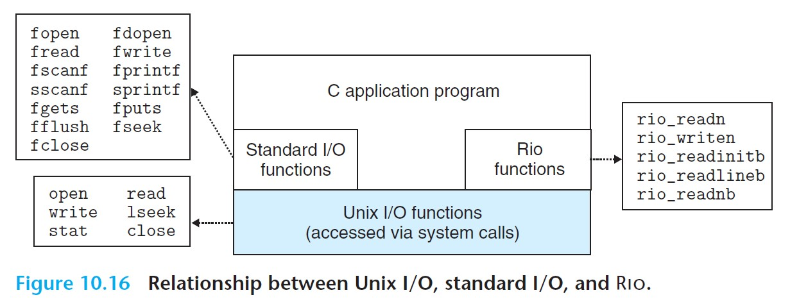

# 10 System-Level I/O

- **Input/output (I/O)** is the process of copying data between the main memory and external devices, such as disk drives, networks, or terminals.
- Higher-level IO functions: **standard I/O library** in C, including `printf` and `scanf`.
- System-level **Unix I/O** functions are provided by the kernel.

<br>

# 10.1 Unix I/O

- Linux **file** - a sequence of *m* bytes.
- All I/O devices (networks, disks, terminals) are modeled as files, and input and output are performed by accessing appropriate files.
- **Unix I/O** - a low-level interface managed by the Linux kernel that performs input and output operations.

### **I/O Operations**

- ***Opening files*** - application asks the kernel to open a file, and the kernel returns a **file descriptor** that identifies the file.
  - All processes created by the Linux shell start with three open files: standard input (0), standard output (1), and standard error (2).
- ***Changing the current file position*** - kernel maintains a **file position** *k*, a byte offset, for each file.
  - `seek` can explicitly set the file position.
- ***Reading and writing files***
  - *Read* copies `n > 0` bytes from a file to memory, starting at file position *k* and incrementing *k* by *n*. Reaching the end of file will trigger the **end-of-file (EOF)** condition.
  - *Write* copies `n > 0` bytes from memory to a file, starting at file position *k* and updating *k*.
- ***Closing files*** - application asks the kernel to close a file, so the kernel frees the data structures related to the file and restores the descriptor to the pool of available descriptors.
  - When a process terminates, the kernel closes all open files and frees their memory.

<br>

# 10.2 Files

### **File Types**

- ***Regular file*** - contains arbitrary data.
  - Can distinguish between **text files**, which contain only ASCII or Unicode characters, and **binary files***, which include everything else.
  - A Linux text file contains a sequence of **text lines**, where each line is a sequence of characters terminated by `\n`.
- ***Directory*** - consists of an array of **links**, each of which maps a *filename* to a file.
  - Each directory has at least two entries: `.` for the directory itself, and `..` for its parent.
- ***Socket*** - a file that communiates with another process across a network.
- Other types are: *named pipes, symbolic links, character, and blocked devices*.

### **Directory Hierarchy**

- The Linux kernel organizes all files in a single **directory hierarchy**.
- Each process has a **current working directory** that identifies its location in the hierarchy.



<br>

- Locations in the hierarchy are specified by **pathnames**.
  - ***Absolute***: starts with `/`, denotes path from the rot.
  - ***Relative***: starts with a file name, denotes path from the current working directory.

<br>

# 10.3 Opening and Closing Files

### `Open` Function

```c
#include <sys/types.h>
#include <sys/stat.h>
#include <fcntl.h>

int open(char *filename, int flags, mode_t mdoe);
// returns new file descriptor, or -1 on error
```

- Converts a `filename` to a file descriptor and returns the descriptor number.
  - The descriptor returned is always the smallest one that is not currently open in the process.
- `flags` indicate how the process accesses the file:
  - O_RDONLY - read only
  - O_WRONLY - write only
  - O_RDWR - read and write
- These `flags` can be `OR`ed with additional instructions for write:
  - O_CREAT - if the file doesn't exist, create a *truncated* (empty) version of it.
  - O_TRUNC - if the file already exists, then truncate it.
  - O_APPEND - before each write, set the file position to the end of the file.
- `mode` specifies the access permision bits of the new file.



<br>

### `Close` Function

```c
#include <unistd.h>

int close(int fd);      // returns 0 if okay, -1 on error
```

- Note that closing a descriptor that is already closed is an error.

<br>

# 10.4 Reading and Writing Files

```c
#include <unistd.h>

ssize_t read(int fd, void *buf, size_t n);
// returns number of bytes read, 0 of EOF, or -1 on error

ssize_t write(int fd, const void *buf, size_t n);
// returns number of bytes written, or -1 on error
```

- `read` copies at most `n` bytes from the current file position of descriptor `fd` to memory location `buf`.
- `write` copies at most `n` bytes from memory location `buf` to the current file position of descriptor `fd`.

### **Short Counts**

- **Short counts** occur when `read` and `write` access fewer bytes than what was actually requested.
- They occur for the following reasons:
  - Encountering EOF on reads.
  - Reading text lines from a terminal.
  - Reading and writing network sockets.

<br>

# 10.5 Robust Reading and Writing with the `RIO` Package

- The `RIO` (Robust I/O) package handles short counts automatically.
- It provides two kinds of functions:
  - *Unbuffered input and output functions*.
  - *Buffered input functions* - reading data from a file whose contents are cached in an application-level buffer.

<br>

## 10.5.1 `RIO` Unbuffered Input and Output Functions

```c
#include "csapp.h"

ssize_t rio_readn(int fd, void *usrbuf, size_t n);
ssize_t rio_writen(int fd, void *usrbuf, size_t n);
// returns number of bytes tranferred, 0 on EOF (rio_readn only), -1 on error
```

- `rio_readn` can only return a short count if it encounters EOF. `rio_writen` never returns a short count.
- Calls to `rio_readn` and `rio_writen` can be interleaved arbitrarily on the same file descriptor.

The implementation of each is as follows:

```c
ssize_t rio_readn(int fd, void *usrbuf, size_t n){
    size_t nleft = n;               // how many remaining bytes
    ssize_t nread;                  // how many bytes read
    char *bufp = usrbuf;            // current file position

    while (nleft > 0) {
        if ((nread = read(fd, bufp, nleft)) < 0) {
            if (errno == EINTR)     // interrupted by sig handler return
                nread = 0;          // will call read() again
            else
                return -1;          // errno set by read()
        } else if (nread == 0)
            break;                  // EOF
        nleft -= nread;
        bufp += nread;
    }
    return (n - nleft);             // return value >= 0
}

size_t rio_writen(int fd, void *usrbuf, size_t n){
    size_t nleft = n;               // how many remaining bytes
    ssize_t nwritten;               // how many bytes read
    char *bufp = usrbuf;            // current file position

    while (nleft > 0) {
        if ((nwritten = write(fd, bufp, nleft)) <= 0) {
            if (errno == EINTR)     // interrupted by sig handler return
                nwritten = 0;       // will call write() again
            else
                return -1;          // errno set by write()
        } else if (nwritten == 0)
            break;                  // EOF
        nleft -= nwritten;
        bufp += nwritten;
    }
    return n;
}
```

<br>

## 10.5.2 `RIO` Buffered Input Functions

- When we need to make repeated `read` calls, like when searching for `\n` in a file, they can become inefficient as `read`ing each byte requires a trap to the kernel.
- `rio_readlineb` copies the text line from an internal ***read buffer***, automatically making a `read` call to refill the buffer when it becomes empty.
- `rio_readnb` is used for files that contain both text lines and binary data.
- `rio_readinitb` is called once per open descriptor, and it associates the descriptor `fd` with the read buffer `rp` of type `rio_t`.

```c
#inlude "csapp.h"

void rio_readinitb(rio_t *rp, int fd);          // returns nothing

ssize_t rio_readlineb(rio_t *rp, void *usrbuf, size_t maxlen);
ssize_t rio_readnb(rio_t *rp, void *usrbuf, size_t n);
// returns number of bytes read, 0 on EOF, or -1 on error
```

- `rio_readlineb` reads the next text line from `rp`, including the terminating `\n`, copies it to memory location `usrbuf`, and appends a `\0` terminator.
  - It reads at most `maxlen-1` bytes, leaving room for the `\0` terminator. Text lines that exceed `maxlen-1` are truncated.
- `rio_readnb` reads up to `n` bytes from `rp` to memory location `usrbuf`.

Example of *read buffer* or type `rio_t`, and `rio_readinitb` that initializes it:

```c
#define RIO_BUFSIZE 8192
typedef struct {
    int rio_fd;                     // descriptor for this internal read buffer
    int rio_cnt;                    // unread bytes in the buffer
    char *rio_bufptr;               // next unread byte in the buffer
    char rio_buf[RIO_BUFSIZE];      // the buffer
} rio_t;

void rio_readinitb(rio_t *rp, int fd){
    rp->rio_fd = fd;
    rp->rio_cnt = 0;
    rp->rio_bufptr = rp->rio_buf;
}
```

### **`rio_read` Function**

- `rio_read` is a buffered version of the Linux `read` function.

```c
static ssize_t rio_read(rio_t *rp, char *usrbuf, size_t n){
    int cnt;

    while (rp->rio_cnt <= 0) {      // refill if buf is empty
        rp->rio_cnt = read(rp->rio_fd, rp->rio_buf, sizeof(rp->rio_buf));
        if(rp->rio_cnt < 0) {
            if (errno != EINTR)     // interrupted by sig handler return
                return -1;
        } else if (rp->rio_cnt == 0)    // EOF
            return 0;
        else
            rp->rio_bufptr = rp->rio_buf;   // reset buffer pointer
    }

    // copy min(n, rp->rio_cnt) bytes from internal buffer to user buffer
    cnt = n;
    if (rp->rio_cnt < n) 
        cnt = rp->rio_cnt;
    memcpy(usrbuf, rp->rio_bufptr, cnt);
    rp->rio_bufptr += cnt;
    rp->rio_cnt -= cnt;
    return cnt;
}
```

We can then use `rio_read` instead of `read` in the implementations of `rio_readlineb` and `rio_readnb`.

<br>

# 10.6 Reading File Metadata

- Use `stat` and `fstat` to retrieve a file's **metadata**.

```c
#include <unistd.h>
#include <sys/stat.h>

int stat(const char *filename, struct stat *buf);
int fstat(int fd, struct stat *buf);
// returns 0, or -1 on error
```

- `stat` takes `filename` as input and fills in the `struct stat` structure with the file's metadata.

<br>

# 10.7 Reading Directory Contents

- Use `opendir` to get a pointer to a ***directory stream***.
- Use the `readdir` family to read the contents of a directory.
- Use `closedir` to close a directory stream and free up its resources.

```c
#include <sys/types.h>
#include <dirent.h>

DIR *opendir(const char * name);
// returns pointer to directory stream, or NULL on error

struct dirent *readdir(DIR *dirp);
// returns pointer to the next directory entry in the stream dirp, or NULL if no more entries

int closedir(DIR *dirp);            
// returns 0 on success, -1 on error
```

Each directory entry is a structure of the form:

```c
struct dirent {
    ino_t d_ino;            // inode number
    char d_name[256];       // filename
};
```

Example of reading the contents of a directory:

```c
#include "csapp.h"

int main(int argc, char **argv){
    DIR *streamp;
    struct dirent *dep;

    streamp = opendir(argv[1]);

    errno = 0;
    while ((dep = readdir(streamp)) != NULL) {
        printf("Found file: %s\n", dep->d_name);
    }
    if (errno != 0)
        unix_error("readdir error");
    
    closedir(streamp);
    exit(0);
}
```

<br>

# 10.8 Sharing Files

First we need to understand how the kernel represents open files:

- **Descriptor table** - each process as a descriptor table, whose entries are indexed by the open file descriptors.
  - Each descriptor entry points to an entry in the file table.
- **File table** - represents the set of open files *shared by all processes*.
  - Each file table entry includes the current file position, a ***reference count*** of the number of descriptor entries that point to it, and a pointer to an entry in the v-node table.
  - Closing a descriptor is to decrement the reference count by 1.
  - The kernel cannot delete a file table entry until its reference count is 0.
- **V-node table** - shared by all processes.
  - Each entry includes most information in the `stat` structure.



<br>

### **File Sharing**

Multiple descriptors can reference the same file through different file table entries. This happens if `open` is called twice for the same filename. Each descriptor would have its distinct file position.



<br>

### **File Sharing between Parent and Child**

- The child gets its own copy of the parent's descriptor table, but it shares the parent's set of open file tables. Thus, the child and the parent share the same file position.
- Parent and child must both close their descriptors before the kernel deletes the file table entry.

If the parent has the open files shown in Figure 10.12 above, then the figure below shows the situation after calling `fork`:



<br>

# 10.9 I/O Redirection

- **I/O redirection** allows users to associate standard input and output with disk files.

```c
linux> ls > foo.txt
// shell will load and execute ls program, with standard output redirected to disk file foo.txt
```

### **`dup2` Function**

```c
#include <unistd.h>

int dup2(int oldfd, int newfd);         
// returns nonnegative descriptor, or -1 on error
```

- `dup2` copies descriptor table entry `oldfd` to descriptor table entry `newfd`, overwriting its previous contents.
- If `newfd` was already open, `dup2` closes `newfd` before it copies `oldfd`.

If we have the situation of Figure 10.12 above, then after we call `dup2(4,1)`, both descriptor 4 and 1 will now point to File B (as shown below). Now, any data writen to standard output will be redirected to File B.



<br>

# 10.10 Standard I/O

- C defines a set of higher-level I/O functions, called the ***standard I/O library (`libc`)***.
  - `fopen`, `fclose`, `fread`, `fwrite`, `fgets`, `fputs`, `scanf`, `printf`.
- Models an open file as a **stream**.
  - To the programmer, a stream is a pointer to a structure of type `FILE`.
  - A stream of type `FILE` is an abstraction for a file descriptor and a *stream buffer*.
  - Purpose of the stream buffer is the same as the `RIO` read buffer: to minimize the number of expensive Linux I/O system calls.

Every ANSI C program begins with three open streams: `stdin`, `stdout` and `stderr`.

```c
#include <stdio.h>
extern FILE * stdin;
extern FILE * stdout;
extern FILE * stderr;
```

<br>

# 10.11 Putting It Together: Which I/O Functions Should I Use?



<br>

- Unix I/O is implemented in the operating system kernel.
- The higher-level `RIO` and standard I/O functions are implemented on top of the Unix I/O functions.

### Guidelines:
- Use the standard I/O functions whenever possible.
- Don't use `scanf` or `rio_readlineb` to read binary files. They are designed for reading text files.
- Use the `RIO` functions for I/O on network sockets.