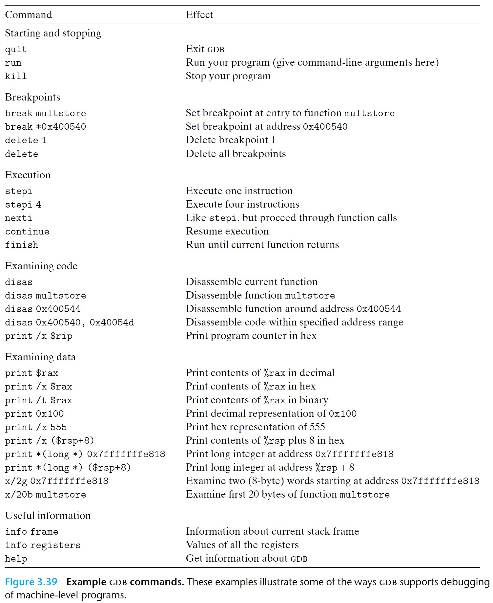
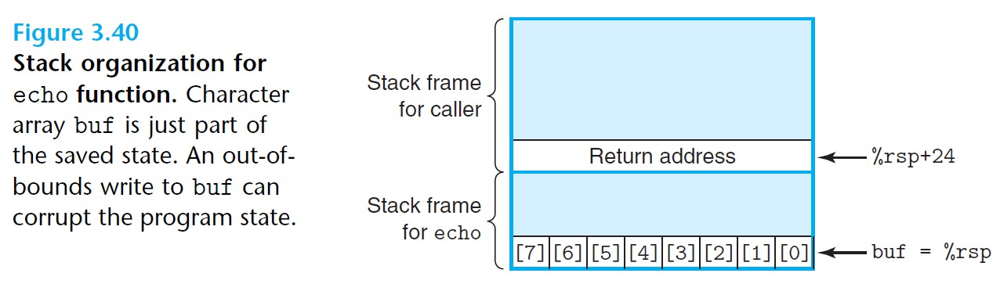
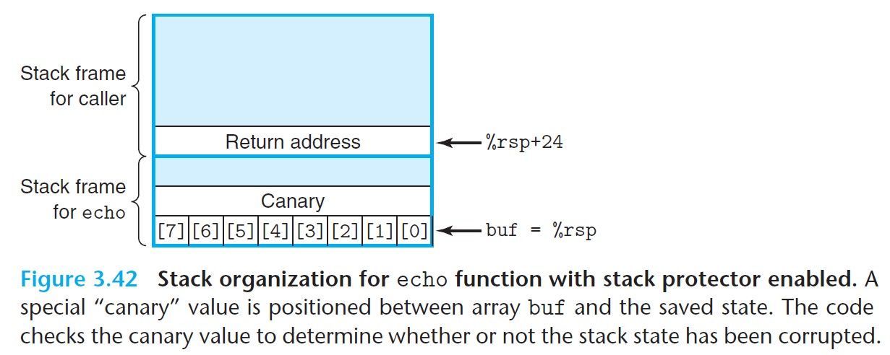
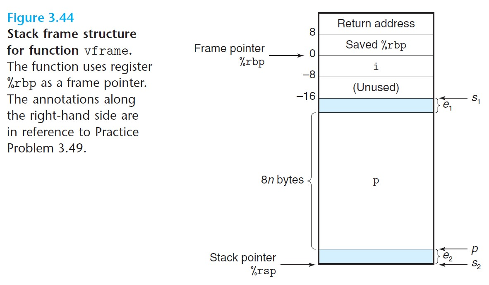

# 3.10 Combining Control and Data in Machine-Level Programs

## 3.10.1 Understanding Pointers

- *Every pointer has an associated type.*
  - `void *` is a special type that represents a generic pointer.
  - Pointer types are not a part of machine code but rather are an abstraction.
- *Every pointer has a value, which is the address of some object.*
  - The special `NULL` (0) value indicates the pointer does not point anywhere.
- *Casting from one type of pointer to another changes its type but not its value.*
  - This kind of casting does change the scaling of pointer arithmetic. For example, for `char * p`, the expression `(int *) p + 7` computes `p + 28`, while `(int *) (p + 7)` computes `p + 7`.

### Function Pointers
- Pointers can also point to functions.
- The value of a function pointer is the address of the first machine-code instruction of the function.

```c
int fun(int x, int *p);             // function

int (*fp) (int, int *);             // fp is function pointer, taking two arguments
                                    // and returns int.
fp = fun;                           // set fp to point to fun

// now we can call the function using fp
int x = 1;
int result = fp(0, &x);
```

<br>

## 3.10.2 Life in the Real World: Using the GDB Debugger



<br>

## 3.10.3 Out-of-Bounds Memory References and Buffer Overflow

- A common source of state corruption: **buffer overflow**
  - Some array is allocated on the stack to hold some data, but the size of the data exceeds the space allocated for the array.

### Example:

```c
// read input line and write it back
void echo(){
    char buf[8];                // only 8 bytes allocated for the array
    gets(buf);
    puts(buf);
}

// generated machine code
echo:
    subq    $24, %rsp           // allocate 24 bytes on the stack
    movq    %rsp, %rdi          // stores address of stack top at %rdi,
                                // to be used as argument for gets
    call    gets
    movq    %rsp, %rdi
    call    puts
    addq    $24, %rsp           // deallocate stack space
    ret
```

The stack organization is as follows:



<br>

Our input string, depending on its length, could lead to undesired overwrites:

| Characters typed | Additional corrupted state |
| ---------------- | -------------------------- |
| 0-7              | None                       |
| 0-24             | Unused stack space         |
| 24-31            | Return address             |
| 32+              | Saved state in caller      |

- *In general, using `gets` or any function that can overflow storage is considered bad programming practice.*

<br>

### Buffer Overflow Attacks
- Get a program to perform a function that it would otherwise be unwilling to do.
- Example: The program is fed with a string that contains the byte encoding of some executable code, called the *exploit code*, plus some extra bytes that overwrite the return address with a pointer to the exploit code.

<br>

## 3.10.4 Thwarting Buffer Overflow Attacks

### I. Stack Randomization

- To inject exploit code into a system, the attacker needs to know where the attack string will be located on the stack.
- *Stack randomization*: make the position of the stack vary from one run of a program to another.
  - This is implemented by allocating a random amount of space on the stack at the start of a program, causing all subsequent stack locations to vary from one execution to another.
- Stack randomization has become standard practice in Linux and is one of a larger class of techniques known as *address-space layout randomization*, or ASLR.
  - ASLR: different parts of the program, including program code, library code, stack, global variables, and heap data, are loaded to different regions of memory each time a program is run.

### II. Stack Corruption Detection

- Another important line of defense is to be able to detect when a stack has been corrupted.
- Recent versions of GCC incorporate a mechanism known as *stack protector* to detect buffer overruns.
  - Randomly generates a special *canary* value each time a program is run, and stores it in the stack frame between any local buffer and the rest of the stack state.
  - Before returning from the function, the program checks if the canary has been altered. If so, the program aborts.



<br>

```c
// echo() with stack protector
echo:
    subq    $24, %rsp
    movq    %fs:40, %rax            // retrieve canary from memory
    movq    %rax,   8(%rsp)         // store canary at *(%rsp+8)
                                    // which is just beyond the region of char buf[7]
    ... // runs echo function

    movq    8(%rsp), %rax           // fetch canary from stack
    xorq    %fs:40, %rax            // compare to stored canary value
    je      .L9                     // if equal, goto ok
    call    __stack_chk_fail        // stack corrupted!
.L9:    // function can return
    addq    $24, %rsp
    ret
```

- The argument `%fs:40` shows that the canary value is read from memory using *segmented addressing*, and by storing the canary in a special segment, it can be marked as "read only."

### III. Limiting Executable Code Regions

- Many systems allow control over three forms of access: *read*, *write*, and *execute*.

<br>

## 3.10.5 Supporting Variable-Size Stack Frames

- Some functions require a variable amount of local storage.
- x86-64 uses register `%rbp` to serve as a *frame pointer*, or *base pointer*.

```c
// Example of variable-size stack frame
long vframe(long n, long idx, long *q){
    long i;
    long *p[n];             // the size of p[n] varies depending on input n, so
                            // the compiler cannot determine the size it needs to 
                            // allocate for the function's stack frame.
    p[0] = &i;
    for(i = 1; i < n; i++)
        p[i] = q;
    return *p[idx];
}

// generated assembly code
// n in %rdi, idx in %rsi, q in %rdx
vframe:
    pushq   %rbp                    // save old %rbp value
    movq    %rsp, %rbp              // set frame pointer %rbp to current stack top

    // allocate space for i
    subq    $16, %rsp               // allocate space for i (%rsp = s1 on image below)
                                    // gives 16 bytes but only first 8 bytes are used

    // allocate space for p
    leaq    22(,%rdi,8), %rax       // rax = 8n + 22
    andq    $-16, %rax              // -16 is 111..1110000 in binary, so this sets the 
                                    // low 4 bytes of rax to 0. This rounds %rax down to
                                    // the nearest multiple of 16.
            // The above 2 lines set %rax (size to allocate for p)
            // to 8n+8 if n is odd and 8n+16 if n is even.
    subq    %rax, %rsp              // allocate space for array p (%rsp = s2 on image below)

    // compute reference to start of p
    leaq    7(%rsp), %rax           // rax = 7 + rsp
    shrq    $3, %rax                // rax >> 3
    leaq    0(,%rax,8), %r8         // r8 = rax * 8
            // The above 3 lines round rax (s2) up to the nearest multiple of 8.
    movq    %r8, %rcx               // set %rcx to &p[0] (%rcx = p on image below)
        ...
# loop: i in %rax and on stack, n in %rdi, p in %rcx, q in %rdx
.L3:
    movq    %rdx, (%rcx, %rax, 8)   // set p[i] to q
    addq    $1, %rax                // increment i
    movq    %rax, -8(%rbp)          // store i on stack, using %rbp to compute position
                                    // note: i is also stored on stack because the 
                                    // program generates a reference to its address.
.L2:
    movq    -8(%rbp), %rax          // retrieve i from stack
    cmpq    %rdi, %rax              / compare i and n
    jl      .L3                     // if <, goto loop
        ...
# code for function exit
    leave                           // restores rsp (by setting it to rbp)
                                    // and restores rbp (popping its old value from stack)
    ret
```

The stack frame organization for function `vframe` is shown below:



*In this image:*
- $s_1$ denotes the value of the stack pointer after allocating space for `i`.
- $s_2$ denotes the value of the stack pointer after allocating space for `p`.
- $p$ denotes the address that references array `p`, and its value is assigned to registers `%r8` and `%rcx` in the assemly code.
- Note that there may be an offset of $e_2$ bytes between the values of $s_2$ and $p$, and an offset of $e_1$ bytes between the end of array `p` and the value of $s_1$.