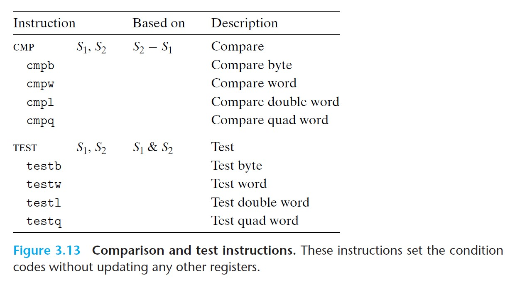
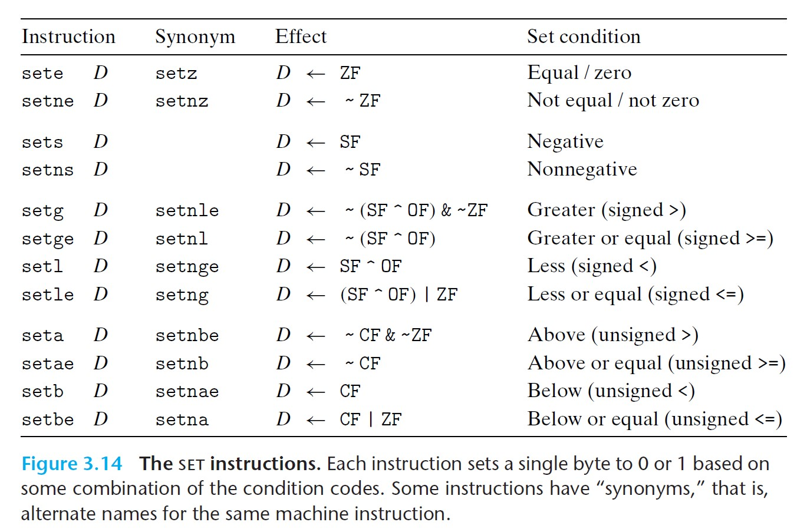
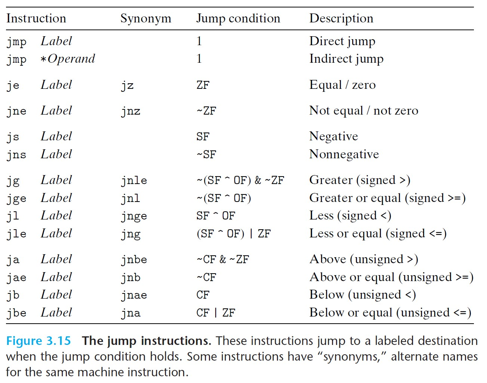
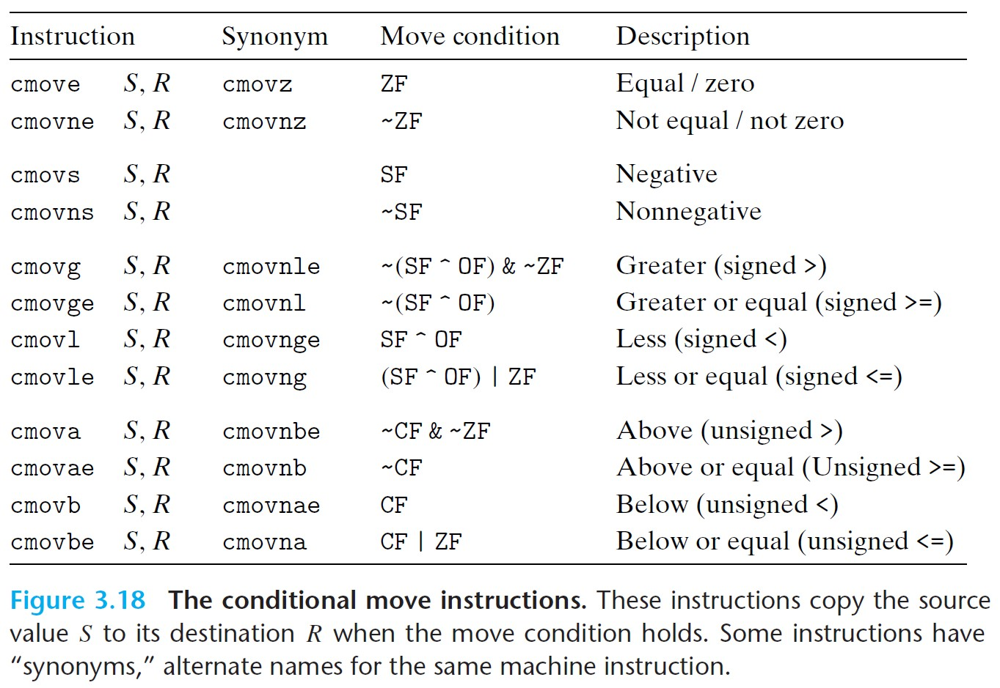

# 3.6 Control

- Two low-level mechanisms for conditional behavior:
  - Testing data values
  - Altering either the control flow or the data flow based on the test results

<br>

## 3.6.1 Condition Codes

- single-bit **condition code** registers, describing attributes of the most recent arithmetic or logical operation.
  - Could test these registers to perform conditional branches.
- All arithmetic operations set condition codes, except for `leaq`

Important condition codes:

- `CF` Carry Flag
  - The most recent operation generated a carry out of the most significant bit.
  - Used to detect overflow for unsigned operations.
- `ZF` Zero Flag
  - The most recent operation yielded zero.
- `SF` Sign Flag
  - The most recent operation yielded a negative value.
- `OF` Overflow Flag
  - The most recent operation caused a two's-complement overflow--either negative or positive.

CMP and TEST instructions:

- `CMP`: Behaves as SUB, but does not update destination
- `TEST`: Behaves as AND, but does not update destination



<br>

## 3.6.2 Accessing the Condition Codes

- Three ways of using condition codes:
  1. Set a single byte to 0 or 1 depending on condition codes.
  2. Conditional transfer of control.
  3. Conditional transfer of data.

We can set a single byte to 0 or 1 depending on the condition codes, using the SET instructions.



<br>

Example:
```
// Function that computes a < b,
// returns 1 if a < b and 0 otherwise.
// int comp(data_t a, data_t b)
// a in %rdi, b in %rsi
comp:
    cmpq %rsi, %rdi         // compare a:b (same as a-b)
    setl %al                // set %al <-- SF ^ OF
    movzbl %al, %eax        // clear rest of %eax (and implicitly rest of %rax)
    ret
```

<br>

## 3.6.3 JUMP Instructions

- Causes the execution of instructions to *jump* to a new position in the program.
- The jump destinations are generally indicated in assembly code by *labels*.



<br>

- *Direct* jump: takes label as jump target
- *Indirect* jump: jump target is read from a register or memory location
  - written using '*' followed by an operand specifier
  - E.g.) `jmp *%rax` uses the value in `%rax` as jump target. `jmp *(%rax)` reads the jump target from the memory address stored in `%rax`.
- *Conditional* jump: jump depending on condition codes

<br>

## 3.6.4 Jump Instruction Encodings

- *PC-relative* encoding: encodes the difference between the address of the target instruction and the address of the instruction immediately following the jump.

<br>

## 3.6.5 Implementing Conditional Branches with Conditional Control

- `goto` shows the workflow of assembly code
- `if` statements generally become the following form:

```
// c code:
if (test-expr)
    then-statement
else
    else-statement

// assembly code
    t = test-expre;
    if (!t)
        goto false;
    then-statement
    goto done;
false:
    else-statement
done:
```

<br>

## 3.6.6 Implementing Conditional Branches with Conditional Moves

- Conditional transfer of data, which computes both outcomes of a conditional operation and then selects one based on whether the condition holds.

Example:
```c
// original C code
long absdiff(long x, long y){
    long result;
    if(x < y)
        result = y - x;
    else
        result = x - y;
    return result;
}

// implementation using conditional assignment
long cmovdiff(long x, long y){
    long rval = y-x;
    long eval = x-y;
    long ntest = x >= y;
    if(ntest) rval = eval;
    return rval;
}

// generated assembly code
// x in %rdi, y in %rsi
absdiff:
    movq    %rsi, %rax
    subq    %rdi, %rax
    movq    %rdi, %rdx
    subq    %rsi, %rdx
    cmpq    %rsi, %rdi
    cmovge  %rdx, %rax      // cmovge implements the conditional assignment
    ret
```

- Conditional data transfers could outperform conditional control transfers, due to the mechanism of *pipelining* in modern processors.
  - Processors achieve high performance through pipelining, where they overlap the steps of the successive instructions. When they reach a conditional branch, they employ *branch prediction logic* to try to guess whether or not a jump instruction will be followed. If the prediction turns out to be wrong, the processor has to discard the work it has done on future instructions and begin refilling the pipeline, which takes a lot of work.



<br>

- Caution: Not all conditional expressions can be compiled using conditional moves.
  - If one of the *then-expression* and *else-expression* could generate an error, this would lead to invalid behavior.
  - E.g. Bad idea for something like `p ? *p : 0`.
- Caution again: Using conditional moves does not always improve code efficiency.
  - If one of the *then-expression* and *else-expression* requires a significant computation, then this efforts is wasted if the corresponding condition does not hold.

## 3.6.7 Loops

Three looping constructs in C:
1. `do-while`
2. `while`
3. `for`

### Do-While Loops

```c
// general form in C
do
    body-statement
    while (test-expr);

// assembly code
loop:
    body-statement
    t = test-expr;
    if (t)
        goto loop;
```

### While Loops

There are a few ways we can translate a while loop into assembly code.

```c
// general form in C
while (test-expr)
    body-statement

// assembly code 1: jump to middle
    goto test;
loop:
    body-statement
test:
    t = test-expr;
    if (t)
        goto loop;

// assembly code 2: guarded do
// Essentially we translate the loop into do-while loop
t = test-expr;
if (!t)
    goto done;
loop:
    body-statement
    t = test-expr;
    if(t)
        goto loop;
done:
```

### For Loops

```c
// general form in C
for (init-expr; test-expr; update-expr)
    body-statement
```

Note that a for loop can be translated into a while loop, so we can use one of the while-loop translation strategies to translate for-loops into assembly code.

```c
// jump-to-middle strategy
    init-expr;
    goto test;
loop:
    body-statement
    update-expr;
test:
    t = test-expr;
    if (t)
        goto loop;

// guarded-do strategy
    init-expr;
    t = test-expr;
    if (!t)
        goto done;
loop:
    body-statement
    update-expr
    t = test-expr;
    if (t)
        goto loop;
done:
```

<br>

## 3.6.8 Switch Statements

- Efficient implementation using *jump table* - an array where entry `i` is the address of a code segment implementing the action the program should take when the switch index equals `i`.
- Advantage (over a long sequence of if-else statements): the time required for a switch is independent of the number of switch cases.
- GCC selects the method of translating a switch statement based on the number of cases and the sparsity of case values. Jump tables are used when there are four or more cases and they span a small range of values.

Jump table in assembly code:
```c
    .section        .rodata     // the instruction addresses are found in 
                                // the segment of the object-code file called .rodata 
                                // (read-only)
    .align 8                    // align address to multiples of 8
.L4:
    .quad   .L3     // instruction address associated with the label .L3
    .quad   .L8     // instruction address associated with the label .L8
    .quad   .L5     // same as above
    .quad   .L6     // same as above
```