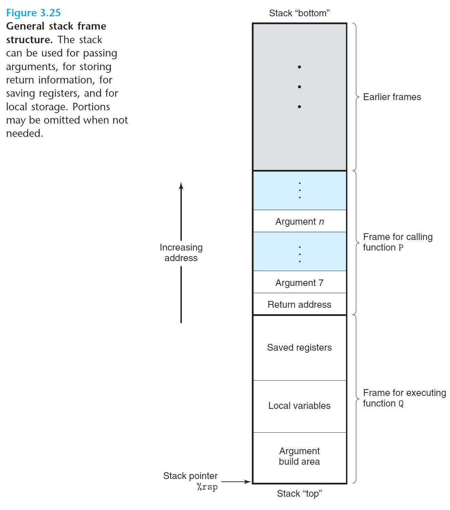
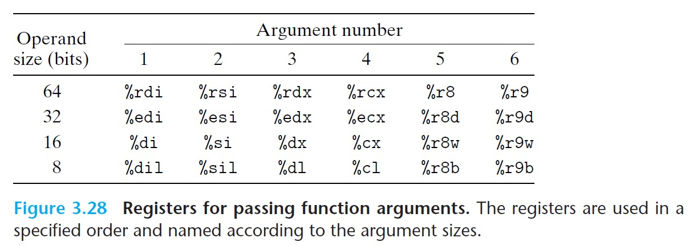
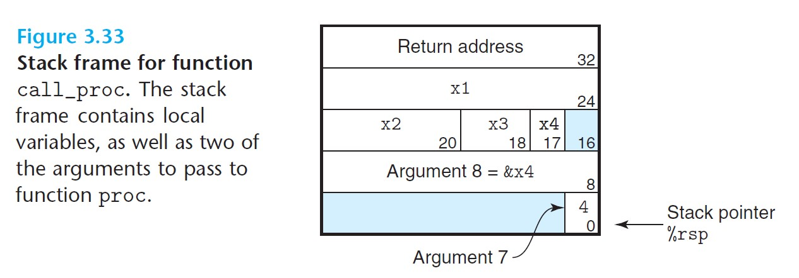

# 3.7 Procedures

- Mechanisms required for the implementation of procedures:
  - Passing control
  - Passing data
  - Allocating and deallocating memory

<br>

## 3.7.1 The Run-Time Stack

- Data can be stored on and retrieved from the stack using `pushq` and `popq` instructions.
- Space is allocated on the stack by decremeting the stack pointer, and is deallocated by incrementing the stack pointer. (Note how the stack grows downward--the pointer decreases as we grow the stack.)
- A procedure allocates space on the stack when it requires storage beyond what it can hold in registers. This is called the procedure's **stack frane**.



<br>

- The frame for the currently executing procedure is always at the top of the stack.
- When procedure P calls procedure Q, it will push the *return address* onto the stack, indicating where within P the program should resume execution once Q returns.
- *Leaf procedure* - procedures that do not require a stack frame, for all its local variables can be held in registers and the function does not call any other functions.

<br>

## 3.7.2 Control Transfer

- **`call` instruction**:
  - Pushes the *return address* onto the stack, which is the address of the instruction immediately following the `call` instruction.
  - Also sets the PC to the beginning of the procedure being called.
- **`ret` instruction**:
  - Pops the return address from the stack.
  - Sets the PC to the return address.
- Syntax:
  - `call` can be either direct (takes a Label as target) or indirect (takes '*' followed by an operand specifier).
  - `ret` takes no arguments.

<br>

## 3.7.3 Data Transfer

- Two data transfers between procedures:
  1. Passing arguments.
  2. Passing return values.
- Most of the data passing occurs through registers.
  - When procedure P calls procedure Q, it must first copy the arguments into the proper registers.
  - When Q returns to P, it must store the return value in `%rax` so that P can access it.

### Using registers:
- With x86-64, up to six integral (i.e. integer and pointer) arguments can be passed via registers.
- The order in which registers are used:



<br>

### Using the stack:
- If a function has more than six integral arguments, the other ones are passed on the stack.
  - If P calls Q, then P copies arguments 1-6 into the appropriate registers and puts arguments 7-n onto the stack, with argument 7 at the top of the stack.
- When passing parameters on the stack, all data sizes are rounded up to be multiples of eight.
- This is the "argument build area" in the stack-frame diagram above.

<br>

## 3.7.4 Local Storage on the Stack

Why we need to store local data in memory instead of registers:
- Not enough registers to hold the local data.
- The address operator `&` has been applied to a local variable, so we have to be able to generate an address for it.
- Some of the local variables are arrays or structures and must be accessed by array or structure references.

### Example:

```c
// swaps *xp and *yp, returns their sum
long swap_add(long *xp, long *yp){
    long x = *xp;
    long y = *yp;
    *xp = y;
    *yp = x;
    return x + y;
}

// caller which would call swap_add
long caller(){
    long arg1 = 534;
    long arg2 = 1057;
    long sum = swap_add(&arg1, &arg2);
    long diff = arg1 - arg2;
    return sum * diff;
}

// generated assembly code for the caller function
caller:
    subq    $16, %rsp               # allocate 16 bytes for the stack frame
    movq    $534, (%rsp)            # store 534 (arg1) at stack[rsp]
    movq    $1057, 8(%rsp)          # store 1057 (arg2) at stack[rsp+8]
    leaq    8(%rsp), %rsi           # compute address of arg2, store at rsi
    movq    %rsp, %rdi              # computer address of arg1, store at rdi
    call    swap_add                # call swap_add(&arg1, &arg2), sum stored at rax
    movq    (%rsp), %rdx            # store arg1 at rdx
    subq    8(%rsp), %rdx           # rdx = arg1 - arg2
    imulq   %rdx, %rax              # compute (arg1-arg2) * sum
    addq    $16, %rsp               # add 16 to get final result
    ret
```

<br>

### Another example that illustrates different data sizes:

```c
long call_proc(){
    long    x1 = 1;
    int     x2 = 2;
    short   x3 = 3;
    char    x4 = 4;
    proc(x1, &x1, x2, &x2, x3, &x3, x4, &x4);
    return(x1+x2) * (x3-x4);
}

// generated assembly code
call_proc:
    subq    $32, %rsp               # allocate stack frame (32-byte)
    movq    $1, 24(%rsp)            # store x1 = 1 at stack[rsp+0x24]
    movl    $2, 20(%rsp)            # store x2 = 2 at stack[rsp+0x20]
    movw    $3, 18(%rsp)            # store x3 = 3 at stack[rsp+0x18]
    movb    $4, 17(%rsp)            # store x4 = 4 at stack[rsp+0x17]
    leaq    17(%rsp), %rax          # stores &x4 at rax 
                                    # (lea instruction only takes register as destination)
    movq    %rax, 8(%rsp)           # store &x4 at stack[rsp+8] (arg8)
    movl    $4, (%rsp)              # store x4 at stack[rsp]    (arg7)
    leaq    18(%rsp), %r9           # store &x3 at r9           (arg6)
    movl    $3, %r8d                # store x3 = r8d            (arg5)
    leaq    20(%rsp), %rcx          # store &x2 at rcs          (arg4)
    movl    $2, %edx                # store x2 at edx           (arg3)
    leaq    24(%rsp), %rsi          # store &x1 at rsi          (arg2)
    movl    $1, %edi                # store x1 at edi           (arg1)
    call    proc                    # call proc
    movslq  20(%rsp), %rdx          # rdx = (long) x2
    addq    24(%rsp), %rdx          # rdx = (long) x2 + x1
    movswl  18(%rsp), %eax          # eax = (int) x3
    movsbl  17(%rsp), %ecx          # ecx = (int) x4
    subl    %ecx, %eax              # eax = (int) x3 - (int) x4
    cltq                            # convert to long
    imulq   %rdx, %rax              # rax = (x1+x2) * (x3-x4)
    addq    $32, %rsp               # deallocate stack frame
    ret                             # return
```



<br>

## Local Storage in Registers

- Registers are shared by all procedures, so when a *caller* procedure calls another *callee* procedure, the callee does not overwrite some register value that the caller needs later.
  - This leads to the adoption of a set of conventions.
- *Callee-saved* registers: `%rbx`, `%rbp`, and `%r12-%r15`.
  - When P calls Q, Q must preserve the values of these registers, ensuring that they have the same values when Q returns to P as they did when Q was called.
  - Q can either leave these registers intact, or push the original values onto the stack and popping them before returning.
- *Caller-saver* registers: all other registers except the stack pointer `%rsp`
  - Can be modified by any function. The caller function is responsible for saving the data before calling another function.

<br>

## 3.7.6 Recursive Procedures

- Each procedure call has its own stack frame, so the local variables of the recursive calls do not interfere with each other.
- The **stack discipline** or allocation and deallocation naturally matches the call-return ordering of functions.