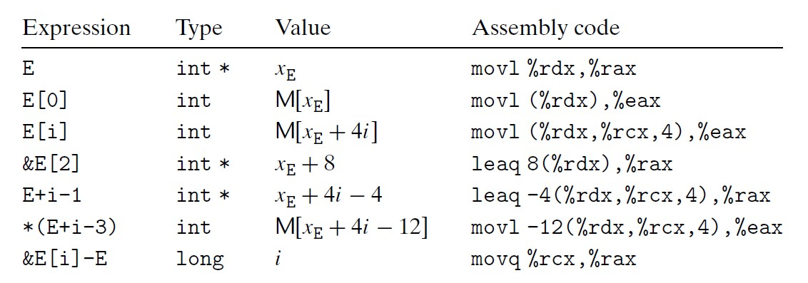
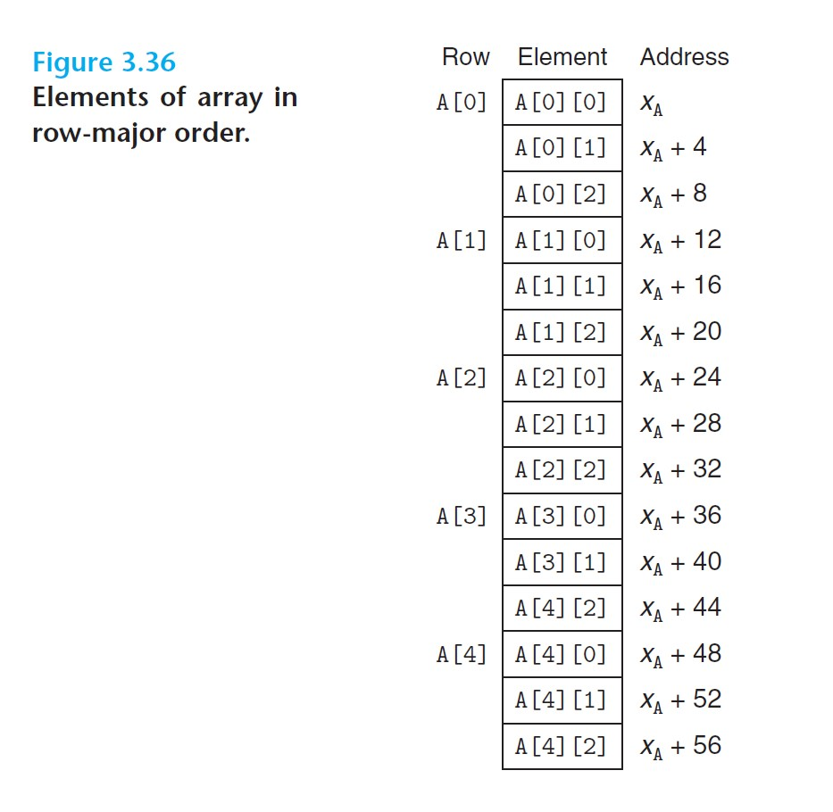

# 3.8 Array Allocation and Access

## 3.8.1 Basic Principles

Consider the declaration: `T A[N]` (data type `T` and integer constant `N`)
- Allocates a contiguous region of $L \cdot N$ bytes in memory, where $L$ is the size (in bytes) of data type `T`.
- Introduces an identifier `A` which can be used as pointer to the beginning of the array.

<br>

Array access in assembly code:
- Consider `int A[4]`, and we wish to access `A[i]`

```c
// suppose address of A is stored in %rdx,
// and i is stored in %rcx
movl    (%rdx, %rcs, 4), %eax   # accesses address A+i*4
```

*Note: `[]` binds tighter than `*`, so `int *A[10]` is equivalent to `int * (A[10])`, where A is an array of 10 elements, and each of those elements is of type `int *`.*

<br>

## 3.8.2 Pointer Arithmetic

- The computed value gets scaled according to the size of the data type referenced by the pointer.
  - E.g. if `p` points to `int`, then the expression `p+i` actually computes `p + 4*i`.

Some array pointer arithmetic examples:



<br>

## 3.8.3 Nested Arrays

- Multi-dimensional array elements are ordered in memory in *row-major* order.
  - This is a consequence of the nested declaration: For `int A[5][3]`, we view `A` as an array of 5 elements, each of which is an array of 3 `int`'s.



<br>

- General declaration: `T D[R][C];`
  - Let the value of pointer `D` be $x$, the array element `D[i][j]` is at memory address $x + L(C \cdot i + j)$, where $L$ is the size of data type `T` in bytes.

<br>

## 3.8.4 Fixed-Size Arrays

- Declaration: `int A[5][5]`.

### Example of compiler optimization in array accessing:

```c
#define N (16);
typedef int fix_matrix[N][N];

// 1) Original code:
// compute inner product of row i from A and col k from B
int prod(fix_matrix A, fix_matrix B, long i, long k){
    long j;
    int result = 0;
    for(j = 0; j < N; j++)
        result += A[i][j] * B[j][k];
    return result;
}

// 2) Optimized C code, based on compiler optimization
int prod_opt(fix_matrix A, fix_matrix B, long i, long k){
    int *pA = &A[i][0];     // points to row i of A
    int *pB = &B[0][k];     // points to column k of B
    int *pBEnd = &B[N][k];  // marks stopping point for pB
    int result = 0;
    do {
        result += *pA * *pB;
        pA++;       // move pA to next column
        pB += N;    // move pB to next row
    } while (pB != pBEnd);  // test for stopping point
    return result;
}

// 3) Generated assembly code, with optimization
// A in %rdi, B in %rsi, i in %rdx, k in %rcs
prod:
    salq    $6, %rdx                # compute 64 * i
                                    # recall that array dimension is 16*16
    addq    %rdx, %rdi              # pA = A + 64i = &A[i][0]
    leaq    (%rsi, %rcx, 4), %rcs   # pB = B + 4k = &B[0][k]
    leaq    1024(%rcx), %rsi        # pBEnd = B + 4k + 1024 = &B[N][k]
    movl    $0, %eax                # set result = 0
.L7:
    movl    (%rdi), %edx            # read *pA
    imull   (%rcx), %edx            # multiply by *pB
    addl    %edx, %eax              # add to result
    addq    $4, %rdi                # increment pA++
    addq    %64, %rcs               # increment pB += N
    cmpq    %rsi, %rcx              # compare pB with pBEnd
    jne     .L7                     # continue with loop
    rep; ret
```

<br>

## 3.8.5 Variable-Size Arrays

- Declaration: `int A[expr1][expr2]`
  - The dimensions of the array are determined by evaluating `expr1` and `expr2` at the time the declaration is encountered.

### Example:

```c
// C code for accessing element i, j of an n-by-n array
int var_ele(long n, int A[n][n], long i, long j){
    return A[i][j];
}

// generated assembly code
// n in %rdi, A in %rsi, i in %rdx, j in %rcs
var_ele:
    imulq   %rdx, %rdi                  # computes n * i
    leaq    (%rsi, %rdi, 4), %rax       # computes A + 4(n*i)
    movl    (%rax, %rcs, 4), %eax       # M[A + 4(n*i) + 4j)]
    ret
```

Note how the dynamic version of array accessing *must use a multiplication instruction to scale $i$ by $n$*, rather than just using `leaq` as we saw before.