# 6.1 Storage Technologies

## 6.1.1 Random Access Memory

- Random access memory (RAM) comes in two varieties: *static* and *dynamic*.

### Static RAM (SRAM)

- Faster, more expensive than DRAM.
- Used for cache memories.
- Stores each bit in a *bistable* memory cell. Each cell is implemented with a six-transistor circuit with the property that it can stay indefinitely in two *states* but will find any other state unstable.
  - When a disturbance causes the cell to move to some other unstable state, it will quickly move toward one of the stable states.
  - This allows SRAM memory cells to retain their values indefinitely as long as it is kept powered.

### Dynamic RAM (DRAM)

- Used for the main memory and the frame buffer of a graphics system.
- Stores each bit as charge on a capacitor.
- Unlike SRAM, DRAM cells are sensitive to disturbance. In fact, when the capacitor voltage is disturbed, it will never recover.

### SRAM vs. DRAM

|      | Transistors per bit | Relative access time | Persistent? | Sensitive? | Relative cost | Applications |
| ---- | ------------------- | -------------------- | ----------- | ---------- | ------------- | ------------ |
| SRAM | 6                   | 1$\times$            | Yes         | No         | 1,000$\times$   | Cache memory |
| DRAM | 1                   | 10$\times$           | No          | Yes        | 1$\times$     | Main memory, frame buffers|

### Conventional DRAMs

- The cells (bits) of a DRAM chip are partitioned into *d* *supercells*, each consisting of *w* DRAM cells.
  - A *d $\times$ w* DRAM stores a total of *d w* bits.
  - The supercells are organized as rectangular array with *r* rows and *c* columns, where *rc = d*. Each supercell has the address of the form (*i, j*), where *i* denotes the row and *j* denotes the column.
- Information flows in and out of the chip via external connectors called *pins*. Each pin caries a 1-bit signal.
  - *The figure below shows eight `data` pins that each transfer 1 bit of data and two `addr` pins that carry 2-bit row and column supercell addresses.*

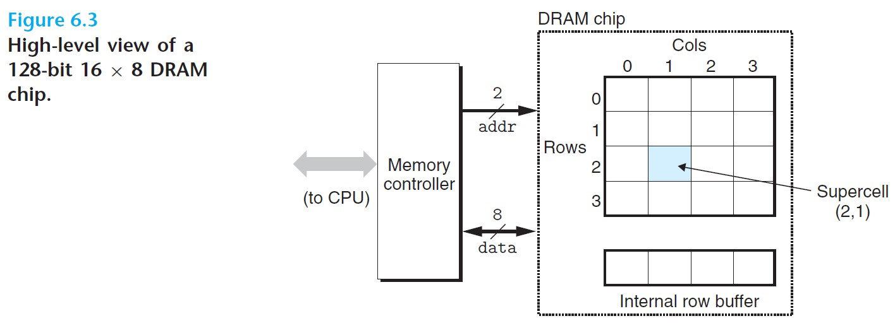

 

- Each DRAM chip is connected to a *memory controller* that transfers *w* bits at a time to and from the chip.
  - To read supercell (2,1), the memory controller sends row address 2. The DRAM responds by copying the entire row 2 into an internal row buffer. Next, the memory controller sends column address 1, and the DRAM responds by sending the 8 bits in supercell (2,1) from the row buffer to the memory controller.

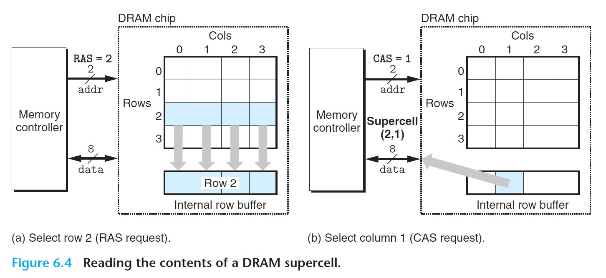

 

### Memory Modules

- DRAM chips are packaged in *memory modules*, consisting of multiple DRAMs. The memory content at each main memory address is stored across the DRAMs at the same supercell address.
- To retrieve a word at memory address *A*, the memory controller converts *A* to a supercell address (*i,j*) and sends it to the memory module, which then broadcasts *i* and *j* to each DRAM. In response, each DRAM outputs the 8-bit contents of its (*i,j*) supercell, and the module collects these outputs and forms them into a 64-bit word, returning it to the memory controller.

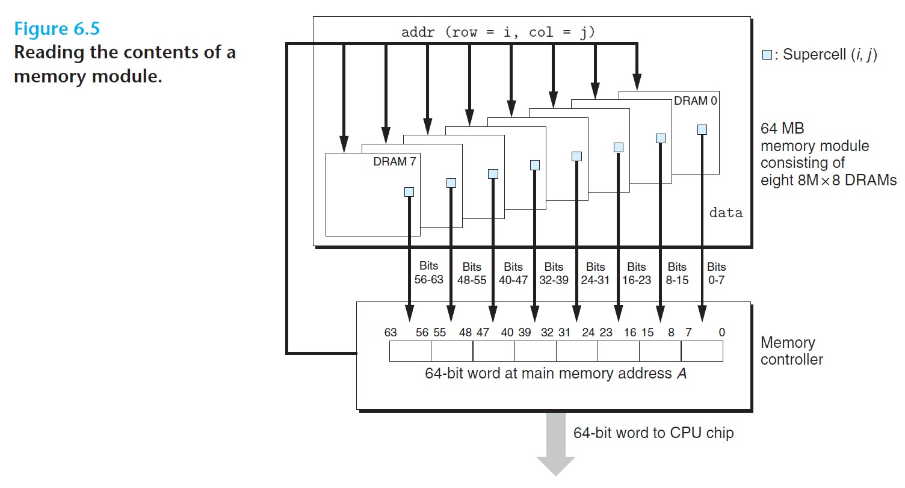

 

### Nonvolatile Memory

- DRAM and SRAM are *volatile* - lose their information if power is turned off.
- *Nonvolatile memories* - retain their information even when powered off.
  - Collectively referred to as *read-only memories* (ROMs).
- Types:
  - *Programmable ROM (PROM)*: can be programmed exactly once.
  - *Erasable programmable ROM (EPROM)*: can be erased and reprogramed on the order of 1,000 times.
  - *Electrically erasable PROM (EEPROM)*: can be reprogrammed on the order of $10^5$ times.
  - *Flash memory*
  - *Solid state disk (SSD)* (see Section 6.1.3)
- Programs stored in ROM devices are referred to as *firmware*. When a computer system is powered up, these are the programs that first get executed.

### Accessing Main Memory

- Data flows between the CPU and DRAM main memory over shared electrical conduits called **buses**. Each transfer of data is accomplished with *bus transactions*.
  - *Read transaction*: transfers data from main memory to CPU.
  - *Write transaction*: transfers data from CPU to main memory.

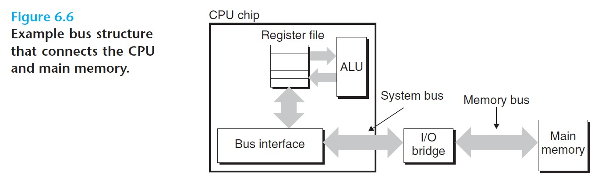

 

Consider what happens when the CPU performs a load operation such as `movq A, %rax`:
1. The *bus interface* of the CPU initiates a read transaction by placing address A onto the system bus. The I/O bridge passes the signal to the memory bus.
2. The main memory senses the address signal on the memory bus, reads the address, fetches data from the DRAM memory modules, and writes the data to the memory bus. The I/O bridge translates the memory
3. The CPU senses the data on the system bus, reads the data, and copies it into register `%rax`.

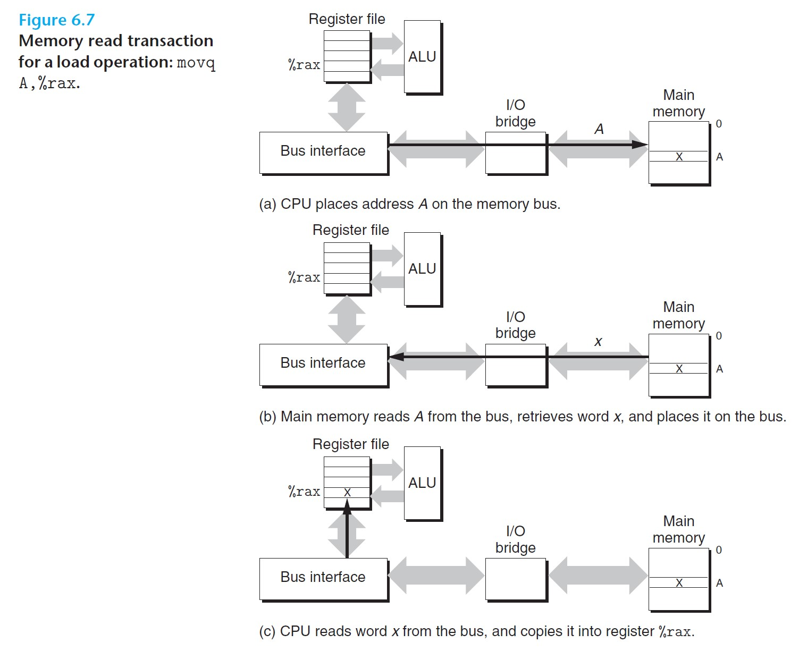

 

A write transaction, like `movq %rax, A`, takes similar steps:

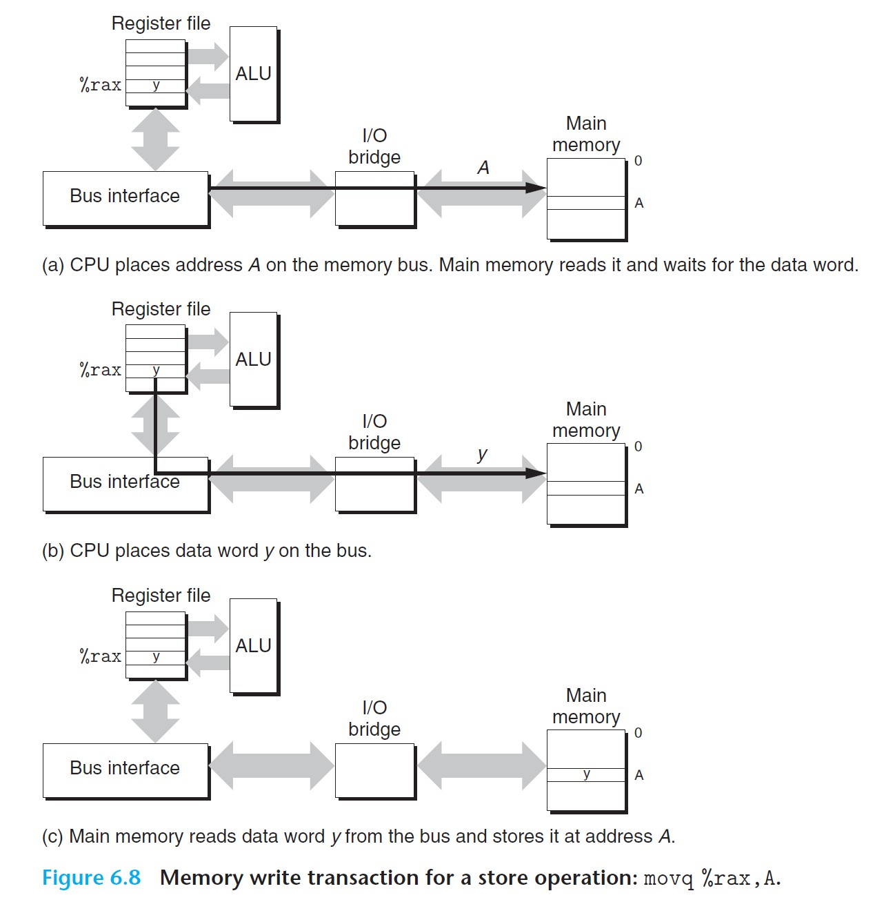

 

## 6.1.2 Disk Storage

- *Disks* hold enormous amounts of data, but it takes much longer to read information from the disk than from SRAM or DRAM.

### Disk Geometry

- Disks are constructed with *platters*, each with two sides or *surfaces*. A disk consists of one or more platters stacked on top of each other.
- A rotating *spindle* at the center of the platter spins the platter at a fixed *rotational rate*.
- A typical disk surface consists of a collection of concentric rings called *tracks*. Each track is partitioned into a collection of *sectors*, and each secto contains an equal number of data bits. Sectors are separated by *gaps* where no data bits are stored.
- A *cylinder* is the collection of tracks on all the surfaces that are equidistant from the center of the spindle.

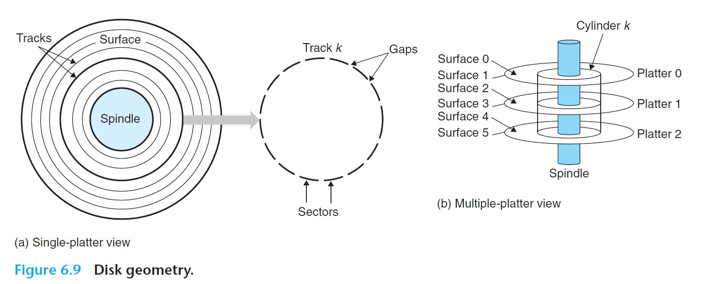

 

- Disks are also referred to as *disk drives*, and they are sometimes referred to as *rotating disks* to distinguish them from the flash-based SSDs.

### Disk Capacity

- *Maximum capacity* of a disk: the maximum number of bits that can be stored by a disk.
- Disk capacity is determined by the following:
  - Recording density (bits/in)
  - Track density (tracks/in)
  - Areal density (bits/in$^2$)

- Modern disks use a technique known as *multiple zone recording*: A set of cylinders is partitioned into subsets known as *recording zones*, and each zone consists of a contiguous collection of cylinders. Each track in each cylinder in a zone has the same number of sectors.

- To calculate the capacity of a disk:
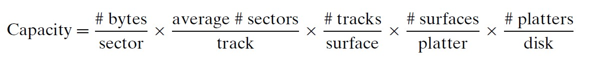

 

### Disk Operation

- Disks read and write bits using a *read/write head* connected to the end of an *actuator arm*. By moving the arm, the drive can position the head over any track on the surface. This motion is known as a **seek**.
- Once the head is positioned over the desired track, then as each bit of the track passes underneath, the head can either read the bit or write the bit.
- The heads are lined up vertically and move in unison.

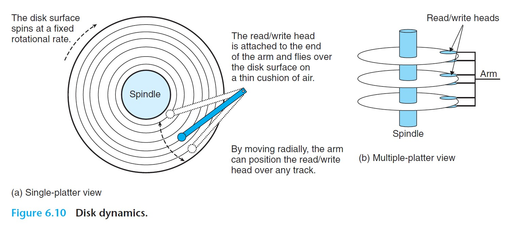

 

- The **access time** for a sector has three components:
  1. *Seek time*: the time required to position the head over the track that contains the target sector.
     - Depends on the previous position of the head and the speed that the arm moves.
     - The average seek time is typically on the order of 3 to 9 ms.
  2. *Rotational latency*: the time it takes for the surface to rotate until the the first bit of the target sector reaches the head.
     - Depends on the position of the surface when the head arrives at the target track and the rotational speed of the disk.
     - Worst case: the head just misses the target sector and waits for the disk to make a full rotation.
     - Average case: half of worst case (only half a rotation).
  3. *Transfer time*: the time needed for the head to read or write the contents of the sector.
     - Depends on the rotational speed and the number of sectors per track.
- *Note: The access time is dominated by the seek time and the rotational latency.*
  - The seek time and the rotational latency are roughly the same, so twice the seek time is a reasonable estimate for the disk access time.

### Logical Disk Blocks

- Modern disks present a simpler view of their geometry as a sequence of *B* sector-size **logical blocks*, numbered 0, 1, ... *B*-1.
- A *disk controller* in the disk package maintains the mapping between logical block numbers and the actual (physical) disk sectors.
  - The operating system sends logical block numbers to the disk controller, and the controller translates the number into a (*surface, track, sector*) triple that identifies the corresponding physical sector.

### Connecting I/O Devices

- I/O devices are conected to the CPU and main memory using an *I/O bus*.
  - System bus and memory bus are CPU-specific, but I/O buses are independent of the underlying CPU.

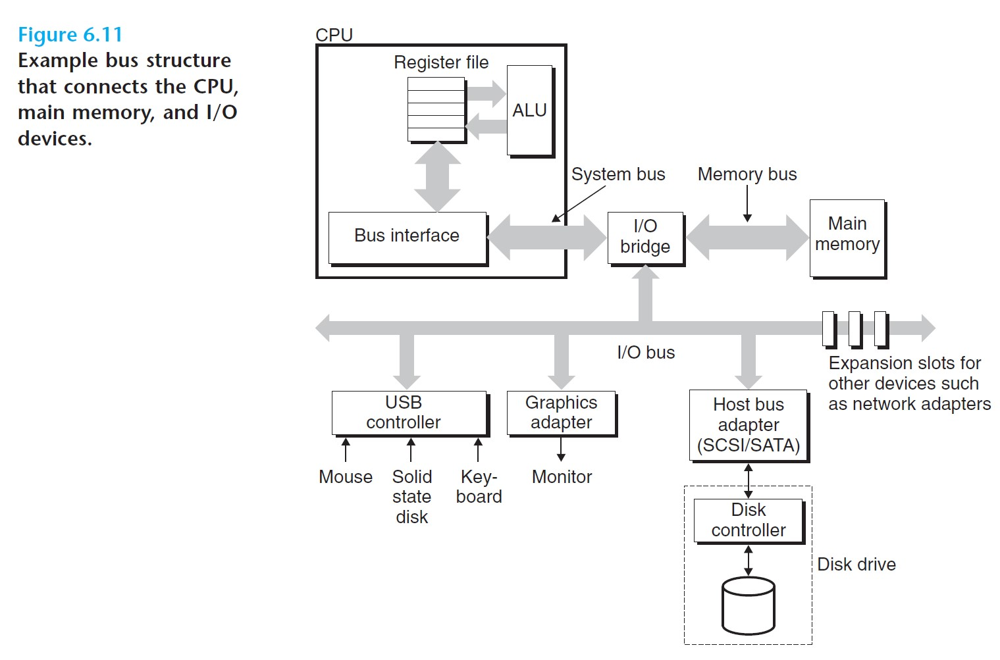

 

### Accessing Disks

- The CPU issues commands to I/O devices using the *memory-mapped I/O* technique.
  - A block of addresses in the address space is reserved for communicating with I/O devices, and each of the address if known as an *I/O port*. Each device is mapped to one or more ports when it is attached to the bus.

1. **Initiating a disk read:**
   - The CPU initiates a disk read by executing three store instructions to the memory-mapped address/port associated with the disk controller:
     1. A command that tells the disk to initiate a read.
     2. Logical block number that should be read.
     3. Destination memory addres where the contents of the disk sector should be stored.
2. **Performing the read**:
   - The disk controller receives the read command, translates the logical block number to a sector address, reads the contents of the sector, and transfers the contents to main memory.
   - The transfer of data to main memory is performed without any involvement of the CPU. This process in which a device performs a read or write bus transaction on its own is known as *direct memory access* (DMA), and the transfer of data is known as a *DMA transfer*.
   - The CPU will typically perform other work while the disk is performing the read, for the read takes quite a bit of time.
3. **Notifying the CPU**:
   - The disk controller notifies the CPU by sending an interrupt signal to the CPU, causing the CPU to jump to an operating system routine that records the fact that the I/O has finished.

 

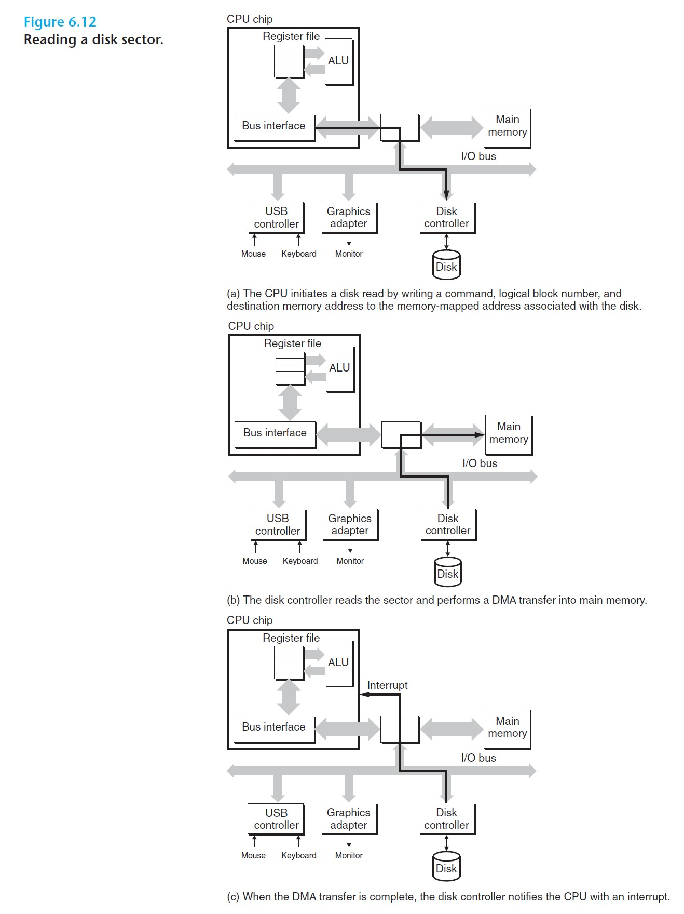

 

## 6.1.3 Solid State Disks

- Solid state disks (SSDs) are based on flash memory.
- Consists of one or more flash memory chips, which replace the mechanical drive of conventional rotating disks, and a *flash translation layer*, which plays the same role as a disk controller, translating requests for logical blocks into accesses of the underlying physical device.
- A flash memory consists of a sequence of *B* *blocks*, where each block consists of *P* pages.
  - Data are read and written in units of pages.
  - A page can be written only after the entire block to which it belongs has been *erased*. This makes random writes slower than reads.

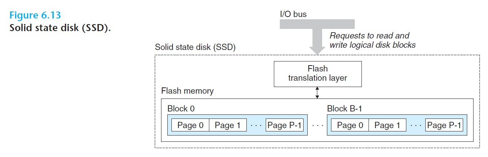

 

- Advantages over rotating disks:
  - Much faster random access times and use less power.
- Disadvantages:
  - Flash blocks wear out after repeated writes, so SSDs can wear out.