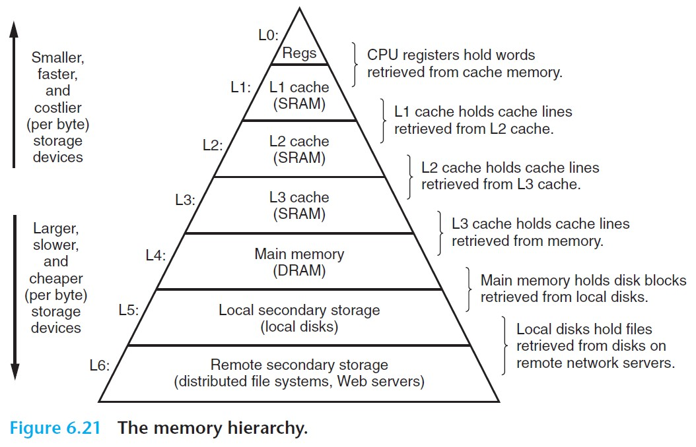
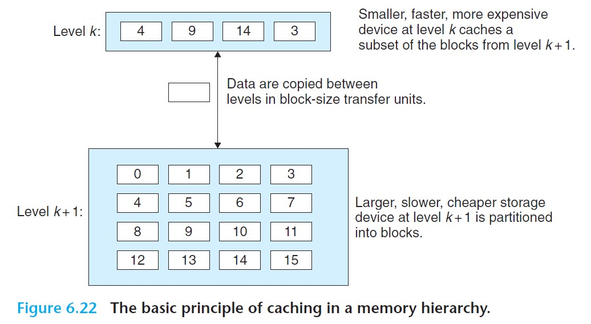
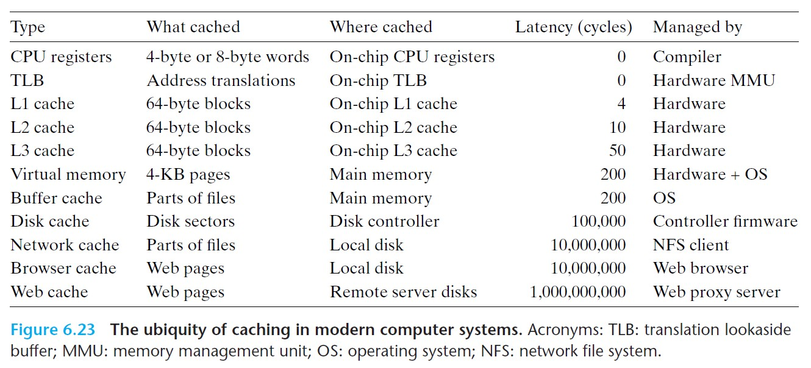

# 6.3 The Memory Hierarchy

The *memory hierarchy* is an approach for organizing memory systems that is used in all modern computer systems.

 

- In general, the storage devices get slower, cheaper, and larger as we move from higher to lower levels.

 

## 6.3.1 Caching in the Memory Hierarchy

- *Cache*: a small, fast storage device that acts as a staging area for the data objects stored in a larger, slower device.
- The central idea of a memory hierarchy is that for each *k*, the faster and smaller storage device at level *k* serves as a cache for the larger and slower storage device at level *k+1*.
  - The storage at level *k+1* is partitioned into contiguous chunks of data objects called *blocks*. At any point, the cache at level *k* contains copies of a subset of the blocks from level *k+1*.
  - Data are always copied back and forth between level *k* and *k+1* in block-size *transfer units*. While the block size is fixed between any particular pair of adjacent levels in the hierarchy, other pairs of levels can have different block sizes.

 

### Cache Hits

- When the program needs a particular data object *d* from level *k+1*, it first looks for it in level *k*. If *d* happens to be cached there, then we have a *cache hit*.
- Reading *d* from level *k* is by the nature of the memory hierarchy faster than reading *d* from level *k+1*.

### Cache Misses

- If data object *d* is not cached at level *k*, then we have a **cache miss**. In this case, the cache at level *k* will fetch the block containing *d* from the cache at level *k+1*, possibly overwriting an existing block in level *k*. After object *d* is fetched into level *k*, the program will read *d* from level *k*.
- The proces of overwriting an existing block is known as *replacing* or *evicting* the block. The block that is evicted is the *victim block*. The decision on which block to evit is governed by the cache's *replacement policy*.
  - For example, a cache may have a *random replacement policy*, or a *least recently used (LRU) replacement policy*.
- Whenever there is a miss, the cache at level *k* must implement some *placement policy* that determines where to place the block it has retrieved from level *k+1*.
  - Hardware caches typically implement a policy that restricts a particular block at level *k+1* to a small subset of the blocks at level *k*.

### Types of Cache Misses

- **Compulsory misses/cold misses**: When a cache at level *k* is empty, the cache is referred to as a *cold cache*, and misses of this kind are compulsory misses or cold misses. The cache will later be *warmed up* by repeated memory accesses.
- **Conflict misses**: The cache is large enough to hold the referenced data objects, but because they map to the same cache block, the references keep missing.
  - For example, if the placement policy dictates that block *i* at level *k+1* can only be cached into block (*i mod 4*) at level *k*, then repeated calls to block 8, then block 0, then block 8, then block 0, and so on, would repeatedly lead to misses since these two blocks map to the same cache block.
- **Capacity misses**: When the cache is too small to handle the *working set* (the set of cache blocks that the phase would reference) of a *phase*.

### Cache Management

- At each level, some form of logic must *manage* the cache. For example, at the highest level of the memory hierarchy, the register files are managed by the compiler.

 