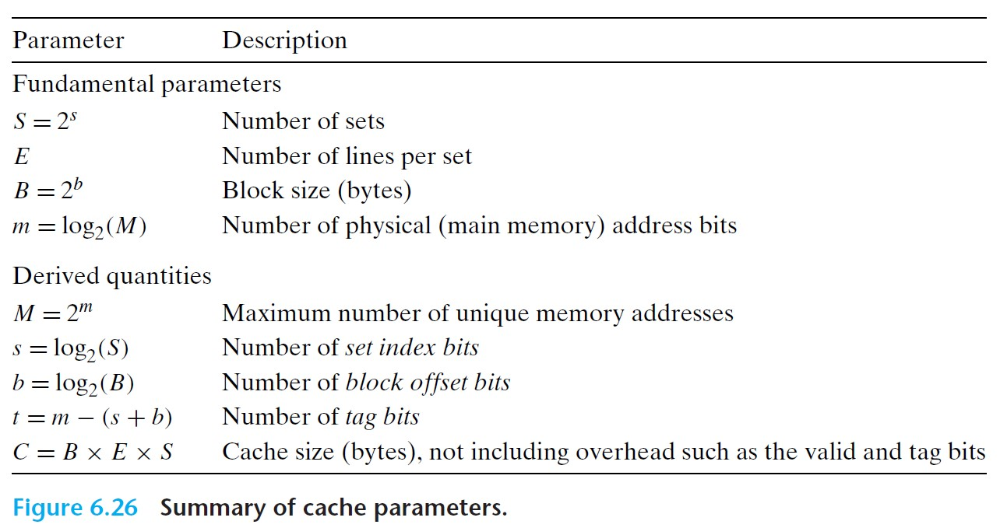

# 6.4 Cache Memories

 

Cache memories typically consist of three levels:
- *L1 cache* (level 1 cache) - can be accessed nearly as fast as registers, typically in about 4 clock cycles.
- *L2 cache* (level 2 cache) - larger than L1 cache, can be accessed in about 10 clock cycles.
- *L3 cache* (level 3 cache) - larger than L2 cache, can be accessed in about 50 cycles.

 

## 6.4.1 Generic Cache Memory Organization

- Consider a computer system where each memory address has *m* bits that form $M = 2^m$ unique addresses.
  - A cache for such a machine is organized as an array of $S = 2^s$ **cache sets**.
  - Each set consists of $E$ **cache lines**.
  - Each line consists of a data **block** or $B = 2^b$ bytes, a **valid bit** that indicates whether the line contains meaningful information, and $t = m - (b + s)$ **tag bits** that uniquely identify the block stored in the cache line.
- We can characterize a cache's organization as the tuple **(*S, E, B, m*)**.
- The *capacity/size* of a cache is $C = S \times E \times B$.
- The *memory address* (of *m* bits) is partitioned into three fields: **tag** (*t* bits), **set index** (*s* bits), and **block offset** (*b* bits).

 

- How to locate data in the cache:
  1. Find the *set* that corresponds to the *set index*.
  2. Inside that set, we look for a *line* that matches the *tag* in the address.
  3. If a) the *tag bits* in the line match the tag bits in the address, and b) the *valid bit* of the line is set, then we have a *cache hit*.
  4. We then use the *block offset* to locate the data in that line.
- *Note that multiple blocks may map to the same cache set, but they are uniquely identified by the tag.*

 

The following are some important parameters in representing cache memories:

 

## 6.4.2 Direct-Mapped Caches

- **Direct-mapped cache*: caches with exactly one line per set ($E = 1$).

 

- A cache has to determine whether a request is a hit or miss and then extract the requested word. There are 3 steps:
    1. *Set selection*
    2. *Line matching*
    3. *Word extraction*

 

### **1. Set Selection in Direct-Mapped Caches**

 

 

- Cache extracs the *s* set index bits from the address for *w*. These bits are interpreted as an unsigned integer that corresponds to a set number.

### **2. Line Matching in Direct-Mapped Caches**

 

 

- In the previously identified set, we look for *w* by checking 1) if the cache line matches the tag in the address of *w*, and 2) if the valid bit is set.
- If the above 2 conditions are satisfied, we have a *cache hit*. Otherwise, we would have a *cache miss*.

### **3. Word Selection in Direct-Mapped Caches**

- Once we have a hit, we know *w* is somewhere in the block. We can locate the first byte of *w* by looking at the block offset bits in the address for *w*.

 

### **Line Replacement on Misses in Direct-Mapped Caches**

- If we have a cache miss, then it needs to retrieve the requested block from the next memory level and store the new block in one of the cache lines of the set indicated by the set index bits.
- If the set is full of valid cache lines, then one of the existing lines need to be evicted.
- In direct-mapped cache, the replacement policy is trivial: the current line of the set is always replaced by the newly fetched line.

 

### **Conflict Misses in Direct-Mapped Caches**

- *Thrashing*: When a cache is repeatedly loading and evvicting the same sets of cache blocks, due to conflict misses.

 

## 6.4.3 Set Associative Caches

- **Set associative cache**: each set can hold more than one cache line.
- A cache with $1 < E < C/B$ is referred to as an **E-way set associative cache**.

 

### **Set Selection in a Set Associative Cache**

 

### **Line Matching and Word Selection in a Set Associative Cache**

 

### **Line Replacement on Misses in Set Associative Caches**

- Random replacement policy: simplest.
- *Least frequently used (LFU)* policy: replace the line that has been referenced the fewest times over some past time window.
- *Least recently used (LRU)* policy: replace the line that was last accessed the furthest in the past.

 

## 6.4.4 Fully Associative Caches

- **Fully associative cache**: consists of a single set (i.e. $E = C/B$) that contains all of the cache lines.

 

### **Set Selection in Fully Associative Caches**

- This is trivial since there is only one set.
- Also there are no set index bits in the address, which is partitioned into just tag bits and block offset bits.

 

### **Line Matching and Word Selection in Fully Associative Caches**

 

- Because there is only one set, the cache circuitry has to search through all cache lines for matching tags, which is rather costly. As a result, fully associative caches are only appropriate for small caches.

 

## 6.4.5 Issues with Writes

### Write Hit
- *Write-through*: to immediately write *w*'s cache block to the next lower level.
  - But this causes bus traffic with every write.
- *Write-back*: to write the updated block to the next lower level only when the block is evicted from the cache by the replacement algorithm.
  - Needs an additional *dirty bit* for each cache line that indicates whether or not the cache block has been modified.

### Write Miss

- *Write-allocate*: to load the corresponding block from the next lower level into the cache and then updates the cache block.
- *No-write-allocate*: bypasses the cache and writes the word directly to the next lower level.

 

*Note: to write reasonably cache-friendly programs, we could asume write-back, write-allocate caches.*

 

## 6.4.6 Anatomy of a Real Cache Hierarchy

- *i-cache*: a cache that holds instructions.
- *d-cache*: a cache that holds data.
- *Unified cache*: a cache that holds both instructions and data.
- Modern processors include separate i-caches and d-caches.
  - Allows processors to read an instruction word and a data word at the same time.
  - I-caches are typically read-only, and thus simpler. The two caches are often optimized to their different access patterns.
  - Reduces capacity misses, by separating data accesses and instruction accesses.

 

## 6.4.7 Performance Impact of Cache Parameters

Cache performance is evaluated by the following metrics:

- *Miss rate* = # misses / # references.
- *Hit rate* = 1 - miss rate.
- *Hit time* = the time to deliver a word in the cache to the CPU, including the time for set selection, line identification, and word selection.
- *Miss penalty* = any additional time required because of a miss.

 

### Impact of Cache Size

- Larger cache tends to increase hit rate, but also increases the hit time. This explains why L1 cache is smaller than L2, and L2 is smaller than L3.

 

### Impact of Block Size

- Large blocks increase the hit rate by exploiting the spatial locality in the program, but for a given cache size, larger blocks imply a smaller number of cache lines, which can hurt the hit rate in programs with more temporal locality than spatial locality.
- Larger blocks also increase miss penalty, for they require longer transfer times.

 

### Impact of Associativity (lines per set)

- Higher associativity decreases the vulnerability of the cache to thrashing due to conflict misses, but is expensive to implement and hard to make fast.

 