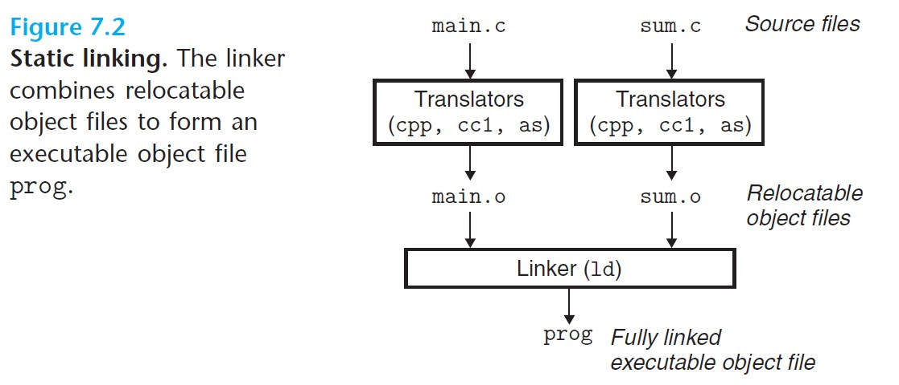
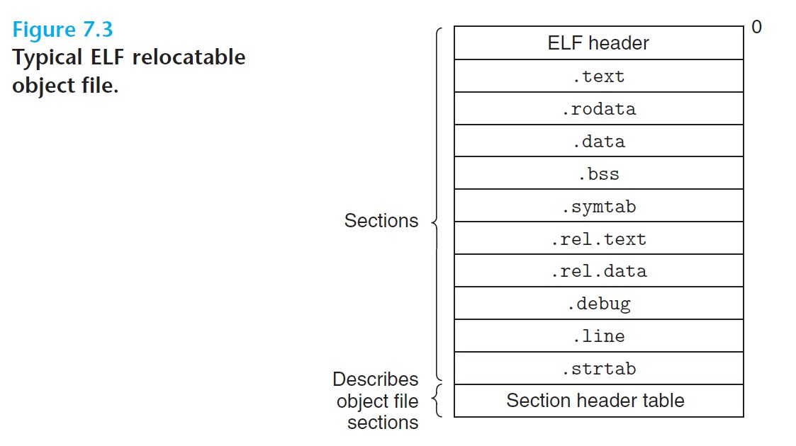
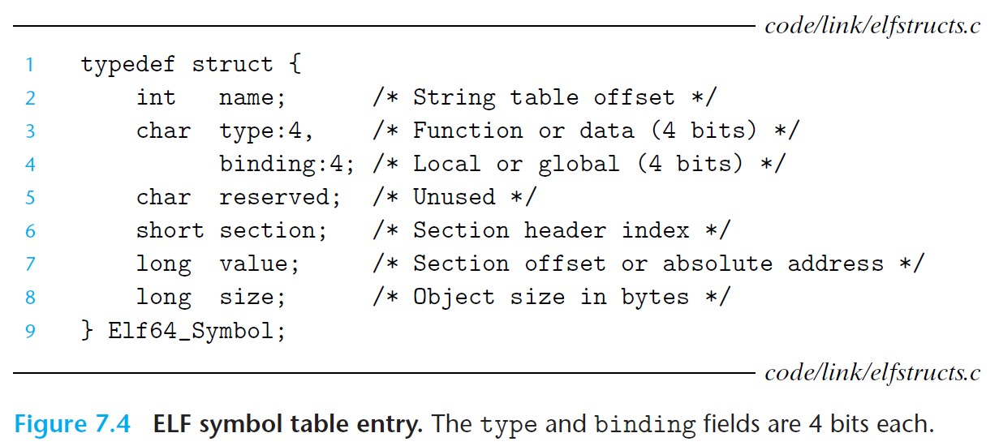
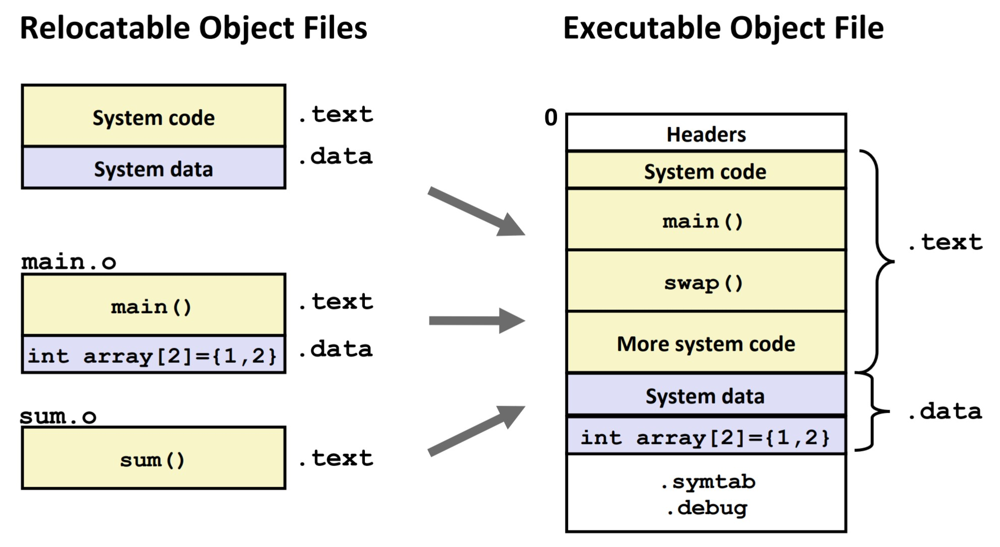
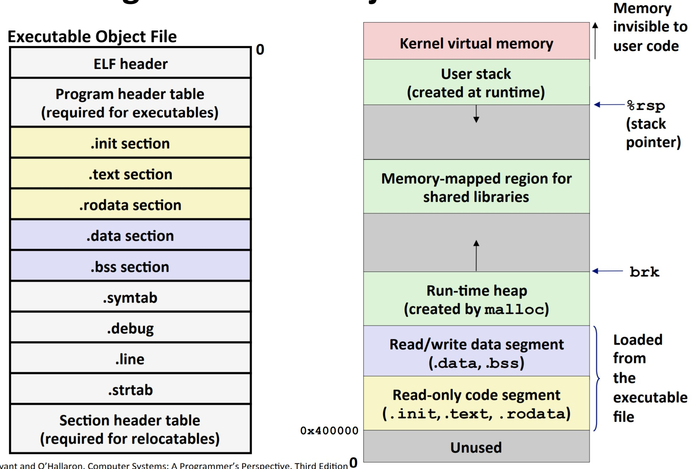

# 7 Linking

- **Linking is the process of collecting and combining various pieces of code and data into a single file that can be *loaded* (copied) into memory and executed.**
- Linking can be performed at compile time (when source code is translated into machine code), load time (when the program is loaded into memroy and executed by the loader), or run time (by application progms).
- Performed by programs called *linkers*.
- Linking allows for **separate compilation**: Instead of compiling a large application as one monolithic source file, we can decompose it into smaller modules that can be modified and compiler separately.

<br>

# 7.1 Compiler Drivers

- Most compilation systems provide a ***compiler driver*** that invokes the language preprocessor, compiler, assembler, and linker as needed.
  - Example: In the GNU compilation system, we invoke the `gcc` driver with `gcc -Og -o prog main.c sum.c`.

- The process in the above example:



<br>

  - Driver first runs the C preprocessor (`cpp`), translating the C source file `main.c` into an ASCII intermediate file `main.i`.
  - Then the driver runs the C compiler (`cc1`), translating `main.i` into an ASCII assembly language file `main.s`.
  - Then the driver runs the assembler (`as`), translating `main.s` into a binary *relocatable object file* `main.o`.
  - Finally, the driver runs the linker program (`ld`), which combines `main.o` and `sum.o`, along with other necessary system object files, to create the binary *executable object file* `prog`.
  - To run `./prog`, the shell invokes a function in the operating system called the *loader*, which copies the code and data of `prog` into memory, and then transfers control to the beginning of the program.

<br>

# 7.2 Static Linking

- ***Static linkers*** such as the Linux `ld` program takes as input a collection of relocatable object files and generate as output a fully linked executable object file that can be loaded and run.

To build the executable, the linker performs 2 tasks:

1. ***Symbol resolution***: To associate each symbol *reference* with exactly one symbol *definition*. A symbol can correspond to a function, a global variable, or a static variable.
2. ***Relocation***: Compilers and assemblers generate code and data sections
that start at address 0, so the linker relocates these sections by associating a memory location with each symbol definition.
    The linker then modifies all references to these symbols so that they point to the right memory location.
   - The linker performs the relocations using **relocation entries** generated by the assembler.

The linker essentially concatenates the byte blocks of object files, decides on run-time locations for the concatenated blocks, and modifies the code so that symbol references point to the right locations.

# 7.3 Object Files

- Object files come in 3 forms:
  - ***Relocatable object file***: contains binary code and data in a form that can be combined with other relocatable object files at compile time to create an executable object file.
    - Generated by compilers and assemblers.
  - ***Executable object file***: Contains binary code and data in a form that can be copied directly into memory and executed.
    - Generated by linkers.
  - ***Shared object file***: A special type of relocatable object file that can be loaded into memory and linked dynamically, at either load time or run time.

<br>

- Object files are organized according to specific *object file formats*, like the `a.out` format in the first Unix systems, Portable Executable (PE) format in Windows, and the Executable and Linkable Format (ELF) in modern x86-64 Linux and Unix systems.

<br>

# 7.4 Relocatable Object Files



<br>

*See the textbook for more information on each of the sections.*

<br>

# 7.5 Symbols and Symbol Tables

- Each relocatable object module *m* has a symbol table that contains information about the symbols that are defined and referenced by *m*.
- For a linker, there are 3 types of symbols:
  - *Global symbols*: defined by module *m*, can be referenced by other modules (*nonstatic* C functions and global variables).
  - *External symbols*: global symbols that are referenced by module *m* but defined by some other module.
  - *Local symbols*: defined and referenced exclusively by module *m*, visible anywhere in *m* but not outside *m* (static C functions, static global variables).

<br>



<br>

- Symbol tables are built by assemblers.
- Symbol table entries:
  - `name`: offset into the string table that points to the null-terminated string name of the symbol.
  - `value`: the symbol's address; for relocatable modules, the `value` is an offset from the beginning of the section where the object is defined, while for executable object files, the `value` is an absolute run-time address.
  - `size`: size of the object in bytes.
  - `type`: usually either `data` or `function`.
  - `section`: each symbol is assigned to some section of the object file, and `section` is an index into the section header table.

<br>

# 7.6 Symbol Resolution

```c
int sum(int *a, int n){
  int i, s = 0;             // local vars, stored on stack only
  for(i = 0; i < n; i++){
    s += a[i];
  }
  return s;
}

int array[2] = {1, 2};        // global

int main(){
  int val = sum(array, 2);    // val is local; linker knows nothing about it
                              // sum is also a global
  return val;
}
```

### Local non-static C variables vs. local static C variabls

```c
int f(){
  static int x = 0;   // static local
  return x;
}

int g(){
  int x = 1;          // non-static local
  return x;
}
```
- Local non-static C variables: stored on the stack
- Local static C variables: stored in either `.bss` or `.data`.
  - But its scope is still limited to the function itself.

### Duplicate Symbol Definitions

- Strong vs Weak program symbols:
  - ***Strong***: procedures, initialized globals
  - ***Weak***: uninitialized globals

```c
int foo1 = 5;     // strong
int foo2;         // weak
p1(){             // strong
}
```

### Linker's Symbol Rules

- **Rule 1**: Multiple strong symbols are not allowed.
  - Each item can be defined only once.
  - Otherwise: *Linker error*!
- **Rule 2**: Given a strong symbol and multiple weak ones, choose the strong symbol.
  - References to the weak symbol resolve to the strong symbol.
- **Rule 3**: If there are multiple weak symbols, choose arbitrary one.
  - Can override this with `gcc -fno-common`.

```c
// module 1
int x = 7;      // this is strong; it gets chosen
int y = 5;

// module 2
double x;       // writing x in module 2 will override y!
```

**Nightmare scenario**: two identical weak structs, compiled by different compilers with different alignment rules.

### Global Variables

- ***Avoid if you can!***
- Otherwise:
  - Use `static` if possible.
  - Initialze if you define a global variable.
  - Use `extern` if you reference an external global variable.

<br>

# Relocation

Relocatable Object Files:



<br>

Linker has to pick an absolute address for each symbol, like for `main()`, or `sum()`.

### Relocation Entries

- Compiler has no clue what the absolute addresses will be, so it leaves a note for the linker to put the correct address later.

<br>

# Loading Executable Object Files



<br>

