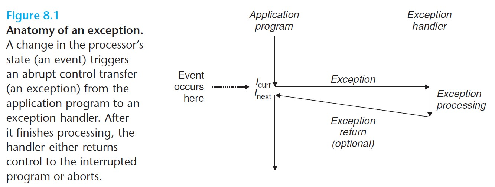
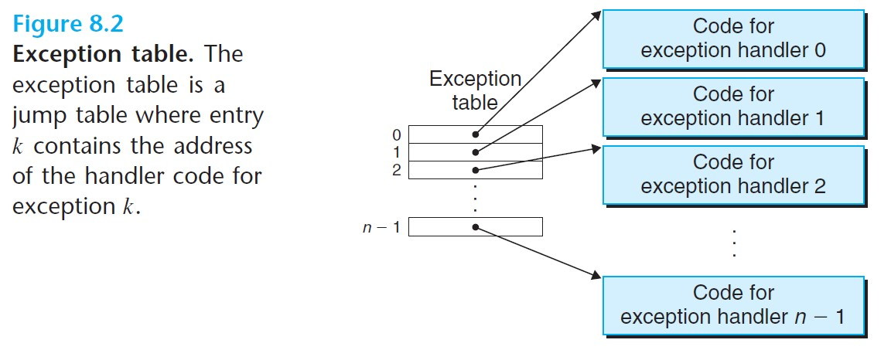
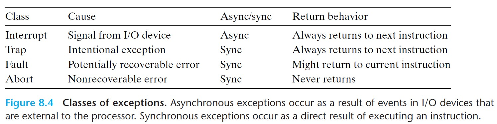
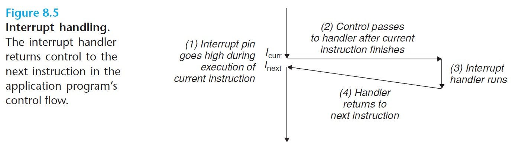
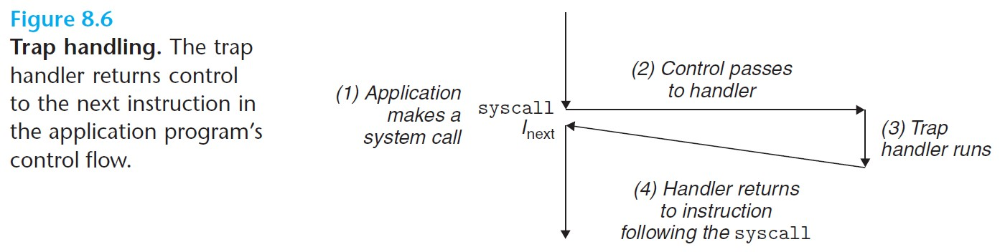
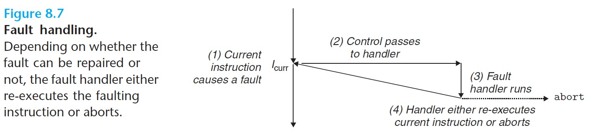
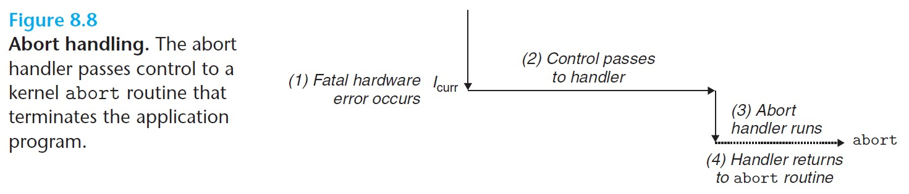
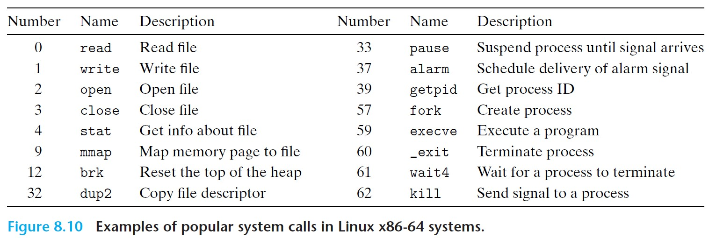

# 8 Exceptional Control Flow

- ***Control transfer***: transition from one instruction to another.
- ***Control flow***: a sequence of such control transfers.
- ***Exceptional control flow (ECF)***: abrupt changes in the control flow, in response to some changes in the system state.

<br>

# 8.1 Exceptions

- **Exceptions**: an abrupt change in the control flow in response to some change in the processor's ***state***.
  - This change is referred to as an ***event***. 
- Exceptions are implemented *partly by the hardware* and *partly by the OS*.



<br>

- When the processor detects the event, it makes an indirect procedure call (the ***exception***), through a jump table called an ***exception table***, to an operating system subroutine (the ***exception handler***) that is designed to process this particular kind of exception.
- When the exception handler finishes its processing, one of the following occurs:
  1. Handler returns control to the current instruction.
  2. Handler returns control to the next instruction.
  3. Handler aborts the interrupted program.

<br>

## 8.1.1 Exception Handling

- Each kind of exception is assigned a unique nonnegative integer ***exception number***.
- At system boot time, the OS allocates and initializes a jump table called an ***exception table***, where each entry *k* gives the address of the handler for exception *k*.



<br>

- The processor calls the exception handler using entry *k* of the exception table.
  - It computes the address of the entry using the exception number (which is an index into the table), and the ***exception table base register*** (which stores the starting address of the exception table).

### Exceptions vs. Procedure Calls

- Both push a return address onto the stack, but depending on the exception, the return address is either the current instruction or the next instruction.
- Exception handlers run in *kernel mode*, which means they can access all system resources.

<br>

## 8.1.2 Classes of Exceptions

Four classes: *interrupts*, *traps*, *faults*, and *aborts*.



<br>

### **Interrupts**

- **Asynchronous** (not caused by the execution of any particular instruction).
- Caused by **signals from I/O devices** external to the processor.
- Always returns to the **next instruction**.
- Afer the handler returns, the program will continue to execute as though the interrupt never happened.



<br>

<br>

### **Traps and System Calls**

- **Synchronous** (caused by executing the current instruction, or the ***faulting instruction***).
- Traps are **intentional** exceptions.
- Always returns to the **next instruction**.
- Provides a procedure-like interface between user programs and the kernel, known as a ***system call***.
  - When the processor executes a `syscall` *n* instruction, requesting service *n*, it causes a trap to an exception handler that decodes the argument and calls the associated kernel routine.



<br>

### **Faults**

- Result from **error conditions** that a handler might be able to correct.
- If the fault handler corrects the error, it returns control to the **faulting instruction**; otherwise, it returns to an **`abort` routine** in the kernel that terminates the program.
- E.g. page fault exception.



<br>

### **Aborts**

- Results from **uncoverable fatal errors**.
- Never returns control to the application program, but rather returns to an **`abort` routine** that terminates the program.



<br>

## 8.1.3 Exceptions in Linux/x86-64 Systems

There are up to 256 exception types.

### Linux/x86-64 Faults and Aborts

***Divide error*** (exception 0) - occurs when an application attempts to divide by zero or when the result of a divide instruction is too big for the destination operand. Unix will abort the program, and Linux shells typically report "Floating exceptions."

***General protection fault*** (exception 13) - occurs usually because a program references an undefined area of virtual memory or attempts to write to a read-only text segment. Linux will abort the program, and shells generally report "Segmentation faults."

***Page fault*** (exception 14) - occurs when an instruction references a virtual address whose corresponding page is not resident in memory and must be retrieved from disk. The handler will map the appropriate page on disk into a page of physical memory, and then restarts the faulting instruction.

***Machine check*** (exception 18) - occurs as a result of fatal hardware error during the execution of the faulting instruction. Control is never returned to the program.

<br>

### Linux/x86-64 System Calls

- Each system call has a unique integer number that corresponds to an offset in a jump table in the kernel.



<br>

- C programs can invoke system calls using `syscall` function, but the C standard library provides a set of wrapper functions for most system calls.

<br>

The `syscall` instruction:
- When making the system call, `%rax` contains the syscall number, with up to six arguments in `%rdi`, `%rsi`, `%rdx`, `%r10`, `%r8`, and `%r9`.
- On return from the system call, `%rax` holds the return value.

```c
// Example of a program using the write system-level function
int main(){
    write(1, "hello world\n", 13);
    _exit(0);
}

// generated assembly code
.section .data
string:
    .ascii "hello, world\n"
string_end:
    .equ len, string_end - string
.section .text
.globl main
main:
    // First, call write(1, "hello, world\n", 13)
    movq    $1, %rax            // write is syscall 1
    movq    $1, %rdi            // arg 1: stdout has descriptor 1
    movq    $string, %rsi       // arg 2: string
    movq    $len, $rdx          // arg 3: string length
    syscall                     // make the system call

    // next, call _exit(0)
    movq    $60, %rax           // _exit is syscall 60
    movq    $0, %rdi            // arg 1: exit status is 0
    syscall                     // make the system call
```