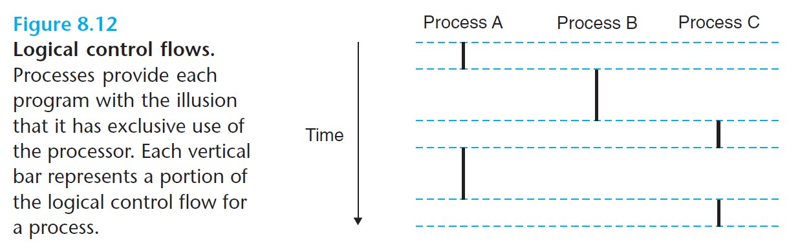
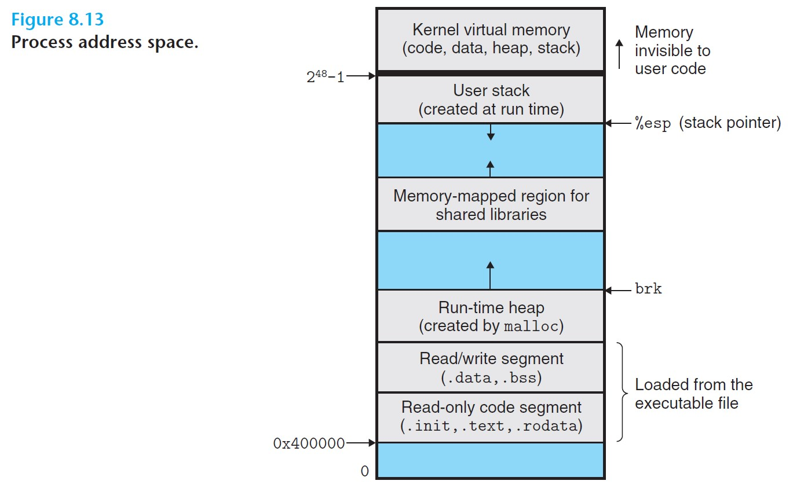
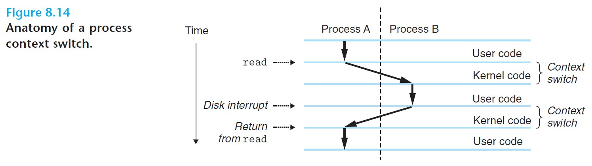

# 8.2 Processes

When we run a program, we get the illusion that our program is the only one running in the system. We seem to have exclusive use of both the processor and the memory. ***These illusions are provided to us by the notion of a process.***

### **What is a process?**

- **Process** - an instance of a program in execution.
- Each program runs in the **context** of some process. The context consists of the **state** that the program needs, including its code and data, its stack, the contents of its registers, its program counter, environment variables, and the set of open file descriptors.
- Key abstractions that a process provides to the application:
  - ***An independent logical control flow***, that provides the illusion that our program has exclusive access to the processor.
  - ***A private address space***, that provides the illusion that our program has exclusive use of the memory system.

 

## 8.2.1 Logical Control Flow

- **Logical control flow** - the sequence of program counter (PC) values that correspond to the instructions of our program.
- When running multiple processes, the single physical control flow of the processor is partitioned into multiple logical flows.
  - Processes take turns using the processor. Each runs a portion of its flow and then is ***preempted*** (temporarily suspended) while others take their turns.

 

## 8.2.2 Concurrent Flows

- **Concurrent flow** - a logical flow whose execution overlaps in time with another flow.
- **Concurrency** - the phenomenon of multiple flows executing concurrently.
- **Multitasking / time slicing** - the notion of a process taking turns with other processes.
- **Time slice** - each time period that a process executes a portion of its flow.
- **Parallel flows** - two flows that are running concurrently on different processor cores or computers. They are said to *run in parallel* and have *parallel execution*.

 

## 8.2.3 Private Address Space

- A process provides each program with its own **private address space**.
- This space is *private* in the sense that memory associated with an address in the space cannot, in general, be read or written by other processes.

Below is a diagram of a private address space for a process:
- The bottom is reserved for the *user program*, with its code, data, heap, and stack segments.
- The top portion is reserved for the *kernel*, including code, data, and stack that the kernel uses when it executes instructions on behalf of the process (e.g. when the program executes a system call).

 

## 8.2.4 User and Kernel Modes

- Processors include a **mode bit** in some control register that characterizes the privileges of the current process.
- When the mode bit is set, the process runs in **kernel mode** (or **supervisor mode**).
  - The process can execute any instruction and access any memory location in the system.
- When the mode bit is not set, the process runs in **user mode**.
  - The process cannot execute *privileged instructions* such as halting the processor or initiating an I/O operation. 
  - It cannot directly reference code or data in the kernel area of the address space, but has to use the system call interface.
- A process running application code starts in user mode. The processor will change the mode to kernel mode when an exception, such as an interrupt, a fault, or a trapping system call, occurs. Exception handlers run in kernel mode. When the handler returns, the processor changes the mode back to user mode.

 

## 8.2.5 Context Switches

- The kernel maintains a **context** for each process.
  - The context is the state that the kernel needs to restart a preempted process. It consists of registers, program counter, user's stack, status registers, kernel's stack, and various kernel data structures such as a page table, a process table, and a file table.
- **Scheduling** - during the execution of a process, the kernel can decide to preempt the current process and restart a previously preempted process.
  - This is handlde by the **scheduler** in the kernel.
- After scheduling a new process to run, the kernel preempts the current process and transfers control to the new process using a **context switch**.
  - The context switch will 1) save the context of the current process, 2) restore the saved context of the previously preempted process, and 3) passes control to the newly restored process.

**When does a context switch occur?**

- It can occur while the kernel is executing a system call that waits for some event to occur, like waiting for data to arrive from the disk.
- It can also occur as a result of a *timer interrupt*, which is implemented by all systems.
- Another instance is a *disk interrupt*, where the disk controller sends an interrupt to signal that the requested data have been transferred from disk to memory.

 