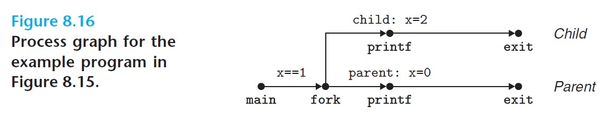
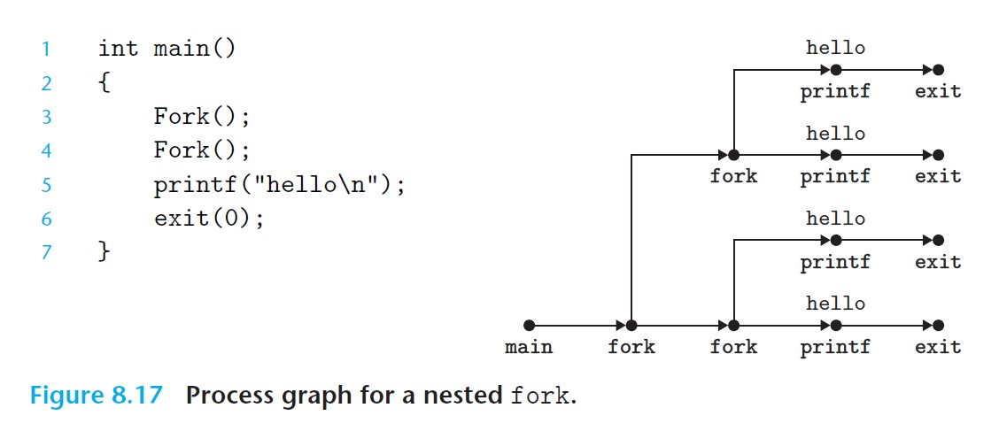
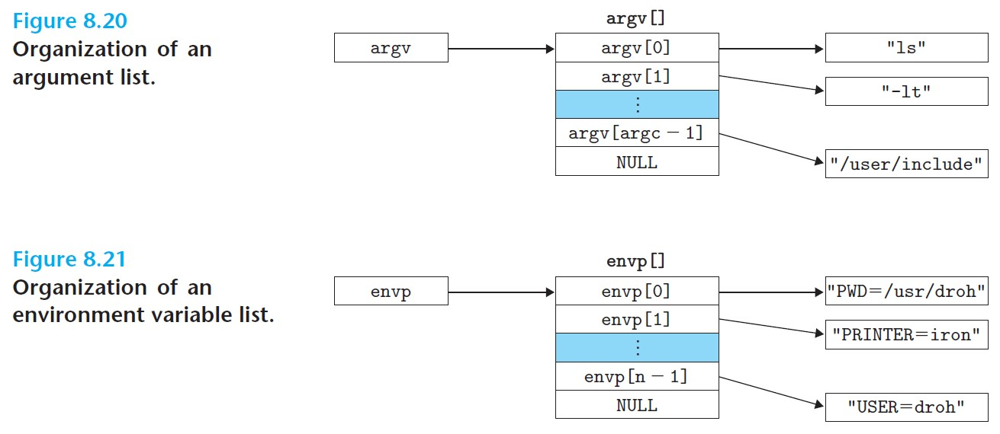
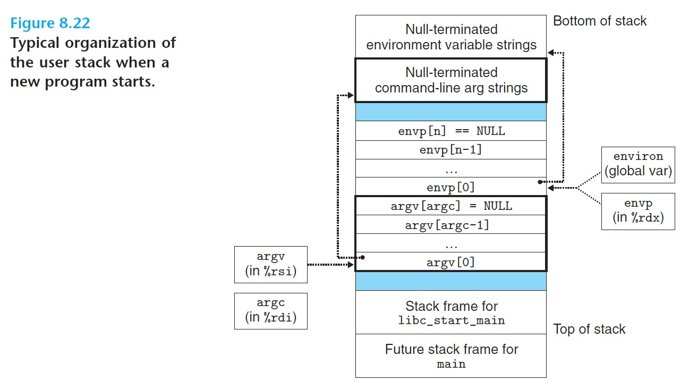

# 8.4 Process Control

Unix gives a set of system calls for manipulating processes.

<br>

## 8.4.1 Obtaining Process IDs

Every process has a unique positive **process ID (PID)**.

```c
#include <sys/types.h>  // defines pid_t as an int
#include <unistd.h>

pid_t getpid(void);     // get pid of the calling process
pid_t getppid(void);    // get pid of its parent
```

<br>

## 8.4.2 Creating and Terminating Processes

A process is in one of three states:

1. ***Running*** - executing on the CPU or waiting to be executed and will eventually be scheduled by the kernel.
2. ***Stopped*** - execution is suspended and will not be scheduled.
   - Stops as a result of SIGSTOP, SIGTSTP, SIGTTIN, or SIGTTOU signal.
   - Remains stopped until a SIGCONT is received.
3. ***Terminated*** - stopped permanently.
   - Caused by: i) receiving a signal that led to termination, ii) returning from the main routine, or iii) calling the `exit` function.

### **`Exit` Function**

- Terminates the process with an *exit status*.
- The other way to set the exit status is to return an `int` from the `main` routine.

```c
#include <stdlib.h>

void exit(int status);      // this function does not return
```

<br>

### **`Fork` Function**

- A *parent process* creates a new running *child process* by calling `fork`.

```c
#include <sys/types.h>
#include <unistd.h>

pid_t fork(void);       // returns 0 to child, PID of child to parent, and -1 on error
```

- The child gets an identical but separate copy of the parent's user-level virtual address space (including code, data, heap, shared libraries, and user stack).
- The child gets an identical copy of any of the parent's open file descriptors.
- The child will have a different PID from the parent.

Example program:

```c
int main(){
    pid_t pid;
    int x = 1;

    pid = Fork();           // wrapper for fork, with error handling
    if(pid == 0) {
        /* child */
        printf("child: x = %d\n", ++x);
        exit(0);
    }

    /* parent */
    printf("parent: x = %d\n", --x);
    exit(0);
}
```

It returns the following:

```
linux> ./fork
parent: x = 0
child: x = 2
```

Note the following in the above example:

- ***Called once, return twice*** - `fork` is called once by the parent. but returns twice in both the parent and the child.
- ***Concurrent execution*** - parent and child are separate processes but run concurrently. Their logical control flows can be interleaved arbitrarily, so we cannot make any assumption about the order of their executions.
- ***Duplicate but separate address spaces*** - the changes that a parent or child makes to `x` are private.
- ***Shared files*** - the child inherits the parent's open files, thus inheriting the open `stdout` file.

A *process graph* of the above example is shown below:



<br>

Process graphs are very helpful, especially with nested `fork` calls. We can examine the example below:



<br>

For a program, any *topological sort* of the vertices in the process graph is a feasible total ordering of the statements in the program.

<br>

## 8.4.3 Reaping Child Processes

### **Reaping**

- When a process terminates, the kernel keeps it around in a terminated state until it is ***reaped*** by the parent. The terminated process in this state is called a *zombie*.
- When the parent reaps the terminated child, the kernel passes the child's exist status to the parent. The child process will then be removed.

### **`Init` Process**

- `init` is created by the kernel during system start-up, never terminates, and is the ancestor of all processes.
- When a parent process terminates, the kernel will make the `init` process adopt any ophaned children.
- If a parent terminates without reaping its zombie children, the kernel will make `init` reap them.

### **`Waitpid` Function**

- A process waits for its children to terminate or stop by calling `waitpid`.

```c
#include <sys/types.h>
#include <sys/wait.h>

pid_t waitpid(pid_t pid, int *statusp, int options);

// returns PID of child, 0 if WNOHANG, or -1 on error
```

- `waitpid` default (`options = 0`): Suspends execution of the calling process until a child process in its *wait set* terminates. If a process in the wait set has already terminated before the call, then `waitpid` will return immediately.
- In either of the above cases, `waitpid` returns the PID of the terminated child. At this point, the terminated child has been reaped and is removed by the kernel.

### **Determining the Wait Set of `waitpid`**

- The *wait set* is determined by the `pid` argument of `waitpid`:
  - If `pid > 0`, the wait set contains only the child process whose PID is `pid`.
  - If `pid = -1`, the wait set contains all of the parent's child processes.

### **Modifying the Default Behavior of `waitpid`**

Default behavior of `waitpid` can be modified by setting `options` to various combinations of the following constants:

- *WNOHANG* - returns immediately (returns 0) if none of the children in the wait set has terminated yet.
  - Useful when we do not want the process to be suspended while waiting for a child to terminate.
- *WUNTRACED* - suspends execution of the calling process until a process in the wait set becomes either terminated or stopped; returns the PID of the child that caused the return.
  - Useful when you want to check for both terminated *and* stopped children.
- *WCONTINUED* - suspends execution of the calling process until a running process in the wait set is terminated or until a stopped process in the wait set has been resumed by a SIGCONT signal.

We can combine the options using OR `|`.

### **Checking the Exit Status of a Reaped Child**

- When `statusp` is non-null, it is a pointer to a `status` field. `waitpid` will encode status information about the child in `status`.

Several macros for `status` argument:
- `WIFEXITED(status)` - returns true if the child terminated normally, via a call to `exit` or a return.
- `WEXITSTATUS(status)` - returns the exit status of a normally terminated child. Only defined if `WIFEXITED()` returned true.
- `WIFSIGNALED(status)` - returns true if the child process terminated because of a signal that was not caught.
- `WTERMSIG(status)` - returns the number of the signal that caused the child to terminate. Only defined if `WIFSIGNALED()` returned true.
- `WIFSTOPPED(status)` - returns true if the child that caused the return is currently stopped.
- `WSTOPSIG(status)` - returns the number of the signal that caused the child to stop. Only defined if `WIFSTOPPED()` returned true.
- `WIFCONTINUED(status)` - returns true if the child process was restarted by receipt of a SIGCONT signal.

### **Error Conditions**

- If the calling process has no children, `waitpid` will return `-1` and sets `errno` to ECHILD.
- If `waitpid` was interrupted by a signal, it returns `-1` and sets `errno` to EINTR.

### **`Wait` Function**

```c
#include <sys/types.h>
#include <sys/wait.h>

pid_t wait(int *statusp);     // returns PID of child or -1 on error
```

`wait(&status)` is equivalent to `waitpid(-1, &status, 0)`.

### **Examples of `waitpid`**

I. Reaping children in *nondeterministic* order:

```c
#include "csapp.h"
#define N 2

int main(){
    int status, i;
    pid_t pid;

    // parent creates N children
    for(i = 0; i < N; i++)
        if ((pid = Fork()) == 0)    // child
            exit(100 + i);
    
    // parent reaps N children in arbitrary order
    while ((pid = waitpid(-1, &status, 0)) > 0) {
        if (WIFEXITED(status))
            printf("Child %d terminated normally with exit status = %d\n", pid, WEXITSTATUS(status));
        else
            printf("Child %d terminated abnormally\n", pid);
    }

    // if errno is ECHILD, means parent has no more children --> not an error
    if (errno != ECHILD)
        unix_error("waitpid error");        // error handling wrapper

    exit(0);
}
```

II. Reaping children in a particular order:

```c
#include "csapp.h"
#define N 2

int main(){
    int status, i;
    pid_t pid[N], retpid;

    // parent creates N children
    for(i = 0; i < N; i++)
        if ((pid[i] = Fork()) == 0)    // child
            exit(100 + i);
    
    // parent reaps N children in the order they were created
    i = 0;
    while ((retpid = waitpid(pid[i++], &status, 0)) > 0) {
        if (WIFEXITED(status))
            printf("Child %d terminated normally with exit status = %d\n", retpid, WEXITSTATUS(status));
        else
            printf("Child %d terminated abnormally\n", retpid);
    }

    // if errno is ECHILD, means parent has no more children --> not an error
    if (errno != ECHILD)
        unix_error("waitpid error");        // error handling wrapper

    exit(0);
}
```

<br>

## 8.4.4 Putting Processes to Sleep

- `sleep` suspends a process for a specific period of time.
- If `sleep` is uninterrupted, it will return 0 after it finishes sleeping, but if it is interrupted by a signal, it will return the number of seconds left to sleep.

```c
#include <unistd.h>

unsigned int sleep(unsigned int secs);      // returns seconds left to sleep
```

- `pause` puts the calling function to sleep until a signal is received by the process.

```c
#include <unistd.h>

int pause(void);            // always returns -1
```

<br>

## 8.4.5 Loading and Running Programs

- `execve` function loads and runs a new program in the context of the current process.

```c
#include <unistd.h>

int execve(const char *filename, const char *argv[], const char *envp[]);

// does not return, or returns -1 on error
```

- `execve` loads and runs the executable object file `filename` with the argument list `argv` and the environment variable list `envp`.
- It returns to the calling program only if there is an error. Otherwise, it is ***called once but never returns***.
- The argument list is a null-terminated array of pointers. By convention, `argv[0]` is the name of the executable object file.



<br>

Below shows the typical organization of the user stack when a new program starts:



<br>

- Bottom of stack: null-terminated environment variable strings and argument strings.
- These are followed by the `envp` and `argv` arrays of pointers, pointing to the environment variable and argument strings.
  - The start of the `envp` array is pointed to by the `environ` global variable.
- At the top we have the stack frame for `libc_start_main`, which is the system startup function.
- The three arguments to main are stored in registers: `argc` in `%rdi`, `argv` in `%rsi`, and `envp` in `%rdx`.

<br>

## 8.4.6 Using `fork` and `execve` to Run Programs

Simple shell program:

```c
#include "csapp.h"
#define MAXARGS 128

void eval(char *cmdline);
int parseline(char *buf, char **argv);
int builtin_command(char **argv);

// main routine
int main(){
    char cmdline[MAXLINE];
    while(1){
        // read
        printf("> ");
        Fgets(cmdline, MAXLINE, stdin);
        if(feof(stdin))
            exit(0);

        // evaluate
        eval(cmdline);
    }
}

// evaluates a command line
void eval(char *cmdline){
    char *argv[MAXARGS];
    char buf[MAXLINE];
    int  bg;            // should the job run in background or foreground?
    pid_t pid;          // process ID

    strcpy(buf, cmdline);
    bg = parseline(buf, argv);
    if(argv[0] == NULL) return;     // ignore empty lines

    if(!builtin_command(argv)){
        if((pid = Fork()) == 0) {
            // child
            if(execve(argv[0], argv, environ) < 0){
                printf("%s: Command not found.\n", argv[0]);
                exit(0);
            }
        }

        // parent waits for foreground job to terminate
        if(!bg){
            int status;
            if(waitpid(pid, &status, 0) < 0){
                unix_error("waitfg: waitpid error");    // error
            }
        } else
            printf("%d, %s", pid, cmdline);
    }
    return;
}

// if firsg arg is built-in command, run it and return true
// note that here, only quit is implemented.
int builtin_command(char **argv){
    if(!strcmp(argv[0], "quit"))        // quit command
        exit(0);
    if(!strcmp(argv[0], "&"))           // ignore singleton &
        return 1;
    return 0;   // not a built-in command
}

// parse the command line and build the argv array;
// returns whether to run in background
int parseline(char *buf, char **argv){
    char *delim;                // points to first space delimiter
    int argc;                   // number of args
    int bg;                     // background job?

    buf[strlen(buf)-1] = ' ';       // replace trailing '\n' with space
    while (*buf && (*buf == ' '))   // ignore leading spaces
        buf++;

    // build the argv list
    argc = 0;
    while ((delim = strchr(buf, ' '))) {
        argv[argc++] = buf;
        *delim = '\0';
        buf = delim + 1;
        while(*buf && (*buf == ' '))    // ignore spaces
            buf++;
    }
    argv[argc] = NULL;

    if(argc == 0)       // ignore blank line
        return 1;

    // should the job run in background?
    if ((bg = (*argv[argc-1] == '&')) != 0)
        argv[--argc] = NULL;

    return bg;
}
```