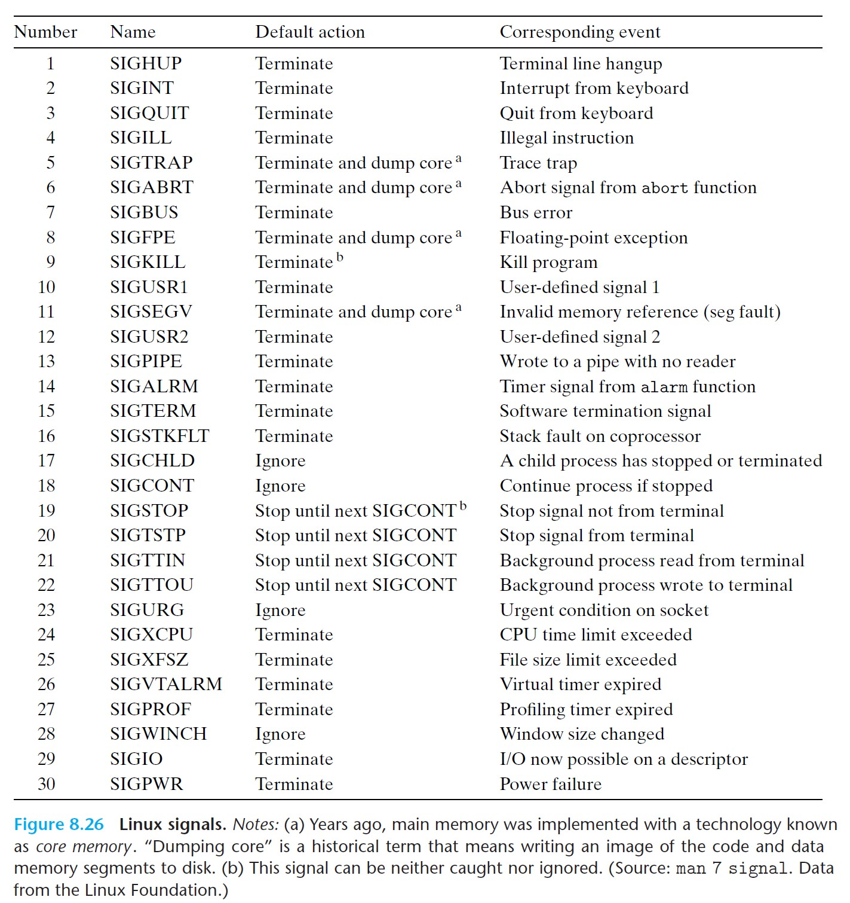
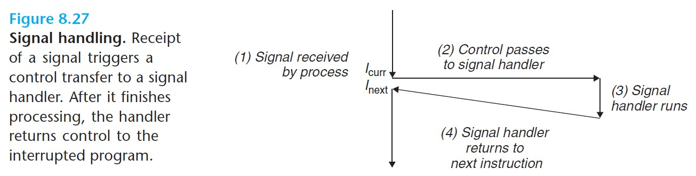
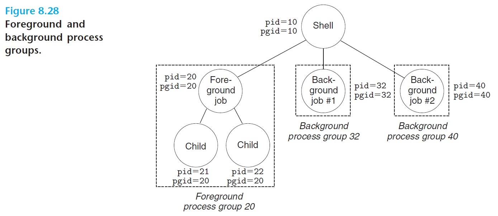
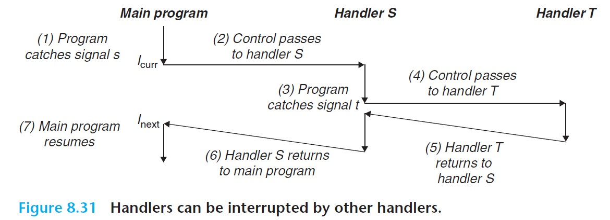

# 8.5 Signals

- Signals are a higher-level software form of exceptional control flow, and they allow processes and kernels to interrupt other processes.
- **Signal** - a small message that notifies a process that an event of some type has occurred in the system.



<br>

## 8.5.1 Signal Terminology

- ***Sending a signal*** - the kernel *sends/delivers* a signal to a destination process by changing some state in the context of that process.
  - A signal is sent for two reasons: 1) the kernel has detected a system event such as a divide-by-zero error, or 2) a process has invoked the `kill` function.
- ***Receiving a signal*** - a destination process receives a signal when it is forced by the kernel to react to the signal.
  - The process can 1) ignore the signal, 2) terminate, or 3) *catch* the signal with a user-level function called the **signal handler**.



<br>

- ***Pending signal*** - a signal that has been *sent* but not yet *received*.
  - At any point in time, there can be at most one pending signal of a particular type. If a process has a pending signal of type *k*, then any subsequent signals of type *k* sent to the process will not be queued but will be discarded.
- A process can ***block*** the receipt of certain signals.
  - When a signal is blocked, it can be delivered but will not be received until the process unblocks it.

<br>

## 8.5.2 Sending Signals

All Unix mechanisms for sending signals to processes rely on the notion of the *process group*.

### **Process Groups**

- Every process belongs to a process group, identified by a positive integer *process group ID*.

```c
#include <unistd.h>

pid_t getpgrp(void);            // returns process group ID of calling process
```

- By default, a child process belongs to the same group as its parent.
- A process can change its own group or the group of another process using `setpgid`.

```c
#include <unistd.h>

// pid - PID of target process (0 indicates current process)
// pgid - new PID we want the process to have (0 indicates PID of the process pecified by pid)
int setpgid(pid_t pid, pid_t pgid);         // returns 0 on success, -1 on error
```

### **Sending Signals with the `/bin/kill` Program**

- `/bin/kill` sends an arbitrary signal to a process.
- E.g. `/bin/kill -9 15213` sends signal 9 (SIGKILL) to every process in the process group 15213.

### **Sending Signals from the Keyboard**

- Processes created as a result of evaluating a single command line are referred to as **jobs**.
- At any point in time, there can be at most one foreground job and 0 or more background ones.



<br>

- `Ctrl+C` causes the kernel to send a SIGINT signal to every process in the foreground process group.
- `Ctrl+Z` causes the kernel to send a SIGTSTP signal to every process in the foreground process group.

### **Sending Signals with the `kill` Function**

```c
#include <sys/types.h>
#include <signal.h>

int kill(pid_t pid, int sig);       // returns 0 if okay, -1 on error
```

- `pid > 0`: sends signal `sig` to process `pid`
- `pid == `0: sends signal `sig` to every process in the process group of the calling process, including the calling process itself
- `pid < 0`: sends signal `sig` to every process in the process group `|pid|` (absolute value of `pid`)

Example:

```c
#include "csapp.h"

int main(){
    pid_t pid;

    // child sleeps until SIGKILL signal is received
    if((pid == Fork()) == 0){
        Pause();            // wait for a signal to arrive
        printf("control should never reach here!\n");
        exit(0);
    }

    // parent sends SIGKILL to its child
    Kill(pid, SIGKILL);
    exit(0);
}
```

### **Sending Signals with `alarm` Function**

```c
#include <unistd.h>

unsigned int alarm(unsigned int secs);      
// returns remaining seconds of previous alarm, or 0 if no previous alarm
```

- Arranges for the kernel tos end SIGALRM to the calling process in `secs` seconds.
- If `secs == 0`, then no new alarm will be scheduled.
- The `alarm` call will cancel any pending alarms and returns the number of seconds remaining until any pending alarm was due to be delivered, or 0 if there were no pending alarms.

<br>

## 8.5.3 Receiving Signals

- When the kernel switches process *p* from kernel mode to user mode, it checks the set of unblocked pending signals for *p* (using `pending & ~blocked`).
  - If the set is empty, the kernel passes control to the next instruction in *p*.
  - If the set is not empty, the kernel will choose some signal *k* in the set and forces *p* to receive that signal.
- Receiving a signal will trigger some **action** by the process.
- Each signal type has a predefined **default action**, which is one of the following:
  - Process terminates.
  - Process terminates and dumps core.
  - Process stops (suspends) until it receives a SIGCONT.
  - Process ignores the signal.
- The default action of signals (except SIGSTOP and SIGKILL) can be modified with `signal` function.
  - If `handler` is SIG_IGN, then signals of type `signum` are ignored.
  - If `handler` is SIGDFL, then the action for signals of type `signum` is reverted to the default.
  - Otherwise, `handler` is the address fo a user-defined function, called a **signal handler**. The invocation of the handler, whenever a signal of type `signum` is received, is called ***catching the signal***.

```c
#include <signal.h>
typedef void (*sighandler_t)(int);

sighandler_t signal(int signum, sighandler_t handler);
// returns pointer to previous handler, or SIG_ERR on error (does not set errno)
```

- When the handler returns, it usually passes control back to the instruction that process *p* was executing when it was interrupted by the signal.

Example of signal handler:

```c
#include "csapp.h"

// SIGINT handler
void sigint_handler(int sig){
    printf("Caught SIGINT!\n");
    exit(0);
}

int main(){
    // install the handler
    if(signal(SIGINT, sigint_handler) == SIG_ERR)
        unix_error("signal error");
    
    pause();        // wait for the receipt of a signal
    return 0;
}
```

- Signal handlers can also be interrupted by other handlers, as shown below.



<br>

## 8.5.4 Blocking and Unblocking Signals

- **Implicit blocking mechanism** - by default, the kernel blocks any pending signals of the type currently being processed by the signal handler.
- **Explicit blocking mechanism** - applications can block and unblock signals explicitly using the `sigprocmask` function.

```c
#include <signal.h>

// changes the blocked signals
int sigprocmask(int how, const sigset_t *set, sigset_t *oldset);

// sets `set` to empty set
int sigemptyset(sigset_t *set);
// adds every signal to `set`
int sigfillset(sigset_t *set);
// adds `signum` to `set`
int sigaddset(sigset_t *set, int signum);
// deletes `signum` from `set`
int sigdelset(sigset_t *set, int signum);

// the above functions return 0 if okay, -1 on error

int sigismember(const sigset_t *set, int signum);
// returns 1 if `signum` is member of `set`, 0 if not, and -1 on error
```

### `sigprocmask`

- Changes the set of currently blocked signals by changing the `blocked` bit vector.
- `how` specifies the specific behavior:
  - SIG_BLOCK: add the signals of `set` to `blocked`, i.e. `blocked = blocked | set`.
  - SIG_UNBLOCK: remove the signals of `set` from `blocked`, i.e. `blocked = blocked & ~set`.
  - SIG_SETMASK: `blocked = set`.
- `oldset` will store the previous value of `blocked` bit vector.

Example:

```c
// Using sigprocmask to block the receipt of SIGINT
sigset_t mask, prev_mask;

Sigemptyset(&mask);
Sigaddset(&mask, SIGINT);

// block SIGINT and save previous blocked set
Sigprocmask(SIG_BLOCK, &mask, &prev_mask);

// code that will not be interrupted by SIGINT

// restore previous blocked set, unblock SIGINT
Sigprocmask(SIGSETMASK, &prev_mask, NULL);
```

<br>

## 8.5.5 Writing Signal Handlers

- Key attribute of signal handlers: they run concurrently with the main program and share the same global variables, and thus can interfere with the main program and with other handlers.

### **Safe Signal Handling**

1. *Keep handlers as simple as possible.*
2. *Call only async-signal-safe functions in the handlers.*
   - **Async-signal-safe** functions have the property that they can be safely called from a signal handler, because a) it is ***reentrant*** (accesses only lcoal variables), or b) it cannot be interrupted by a signal handler.
   - The only safe way to generate output from a signal handler is to use `write`.
3. *Save and restore `errno`.*
   - Async-signal-safe functions may set `errno` when they return with an error, so calling these functions may interfere with other parts of the program that uses `errno`.
4. *Protect accesses to shared global data structures by blocking all signals.*
   - If a handler shares a global variable with the main program or with other handlers, then the handler and the main program should block all signals while accessing that data.
5. *Declare global variables with `volatile`.*
   - This tells the compiler not to cache a variable, since the variable may be modified by handlers.
6. *Declare flags with `sig_atomic_t`.*
   - If a handler needs to update some global flag, we should declare the flag as `volatile sig_atomic_t flag`. This guarantees that all reads and writes to the variable are **atomic**. We would no longer need to block signals during accesses to these variables.

### **Correct Signal Handling**

- Pending singals are not queued.
- ***The existence of a pending signal merely indicates that *at least* one signal of the type has arrived***.

Example:

```c
/* buggy handler! assumes signals are queued. */
void handler1(int sig){
    int olderrno = errno;

    if((waitpid(-1, NULL, 0)) < 0)
        sio_error("waitpid error");
    Sio_puts("Handler reaped child\n");
    Sleep(1);
    errno = olderrno;
}

/* main routine */
int main(){
    int i, n;
    char buf[MAXBUF];

    // install the signal handler
    if (signal(SIGCHLD, handler1) == SIG_ERR)
        unix_error("signal error");

    // parent creates children
    for(i = 0; i < 3; i++){
        if(Fork() == 0){
            printf("Hello from child %d\n", (int)getpid());
            exit(0);
        }
    }

    // parent will do other stuff while waiting for children to terminate
    printf("Parent processing stuff\n");
    while(1)
        ;
    
    exit(0);
}
```

The above handler might not reap all children, for not all SIGCHLD signals will be received. If a SIGCHLD is received while the handler is processing a previously received SIGCHLD, the new signal will simply be discarded. The child process associated with the new signal will then never be reaped.

The crucial lesson here is that ***we cannot use signals to count the occurrence of events***.

The solution to the above problem is to reap as many zombie children as possible whenever a SIGCHLD is received:

```c
void handler2(int sig){
    int olderrno = errno;

    // reap all zombie children
    while(waitpid(-1, NULL, 0) > 0)
        Sio_puts("Handler reaped child\n");
    
    if(errno != ECHILD)
        Sio_error("waitpid error");
    Sleep(1);
    errno = olderrno;
}
```

### **Portable Signal Handling**

- We can use the wrapper function `Signal`, propsed by W. Richard Stevens, which calls `sigaction` for us.

```c
#include <signal.h>

int sigaction(int signum, struct sigaction *act, struct sigaction *oldact);
// returns 0 if okay, -1 on error

// sigaction is unwieldy, so we can use a Signal wrapper
```

- The `Signal` wrapper installs a handler with the following attributes:
  - Only signals of the type currently being processed by the handler are blocked.
  - Signals are not queued.
  - Interrupted system calls are automatically restarted whenever possible.
  - Once the handler is installed, it remains installed until `Signal` is called with the `handler` argument as either SIG_IGN or SIG_DFL.

<br>

## 8.5.6 Synchronizing Flows to Avoid Nasty Concurrency Bugs

- **Race** - synchronization error between two concurrent flows.

Example shell problem with **synchronization error**:

```c
/* buggy code! */
void handler(int sig){
    int olderrno = errno;
    sigset_t mask_all, prev_all;
    pid_t pid;

    Sigfillset(&mask_all);
    while ((pid = waitpid(-1, NULL, 0)) > 0) {
        // reap a zombie child
        Sigprocmask(SIG_BLOCK, &mask_all, &prev_all);   // block all signals
        deletejob(pid);     // delete child from the job list
        Sigprocmask(SIG_SETMASK, &prev_all, NULL);
    }

    if (errno != ECHILD)
        Sio_error("waitpid error");
    errno = olderrno;
}

int main(int argc, char **argv){
    int pid;
    sigset_t mask_all, prev_all;

    Sigfillset(&mask_all);
    Signal(SIGCHLD, handler);   // install handler
    initjobs();                 // initialize job list

    while (1) {
        // child
        if ((pid = Fork()) == 0)
            Execve("/bin/date", argv, NULL);

        // parent
        Sigprocmask(SIG_BLOCK, &mask_all, &prev_all);
        addjob(pid);    // add child to job list
        Sigprocmask(SIG_SETMASK, &prev_all, NULL);
    }
    exit(0);
}
```

In the above code, if the child finishes before the parent reaches `addjob`, then we will have the handler run `deletejob` before the parent has a chance to add the child to the job list. This is a **race** between `addjob` and `deletejob`.

We can fix this problem by blocking SIGCHLD signals before calling `fork` and unblocking them only after we have called `addjob`. This would ensure that the child is reaped after it is added to the job list.

Also note that the child inherits the `blocked` bit vector of the parent, so we have to unblock SIGCHLD in the child.

```c
/* Fixed synchronization error! */
void handler(int sig){
    int olderrno = errno;
    sigset_t mask_all, prev_all;
    pid_t pid;

    Sigfillset(&mask_all);
    while ((pid = waitpid(-1, NULL, 0)) > 0) {
        // reap a zombie child
        Sigprocmask(SIG_BLOCK, &mask_all, &prev_all);
        deletejob(pid);     // delete child from the job list
        Sigprocmask(SIG_SETMASK, &prev_all, NULL);
    }

    if(errno != ECHILD)
        Sio_error("waitpid error");
    errno = olderrno;
}

int main(int argc, char **argv){
    int pid;
    sigset_t mask_all, mask_one, prev_one;

    Sigfillset(&mask_all);
    Sigemptyset(&mask_one);
    Sigaddset(&mask_one, SIGCHLD);
    Signal(SIGCHLD, handler);       // install handler
    initjobs();                     // init job list

    while (1) {
        Sigprocmask(SIG_BLOCK, &mask_one, &prev_one);   // block SIGCHLD
        if ((pid = Fork()) == 0) {
            // child
            Sigprocmask(SIG_SETMASK, &prev_one, NULL);  // unblock SIGCHLD
            Execve("/bin/date", argv, NULL);
        }
        // parent
        Sigprocmask(SIG_BLOCK, &mask_all, NULL);        // block all signals
        addjob(pid);        // add child to job list
        Sigprocmask(SIG_SETMASK, &prev_one, NULL);      // unblock all signals, including SIGCHLD
    }
}
```

<br>

## 8.5.7 Explicitly Waiting for Signals

Example: when a Linux shell creates a foreground job, it has to wait for the job to finish and be reaped by the SIGCHLD handler before it can accept the next user command.

```c
#include "csapp.h"

volatile sig_atomic_t pid;

void sigchld_handler(int s){
    int olderrno = errno;
    pid = waitpid(-1, NULL, 0);     // reap child
    errno = olderrno;
}

void sigint_handler(int s) {}

int main(int argc, char ** argv){
    sigset_t mask, prev;

    Signal(SIGCHLD, sigchld_handler);   // install handler
    Signal(SIGINT, sigint_handler);     // install handler
    Sigemptyset(&mask);
    Sigaddset(&mask, SIGCHLD);

    while (1) {
        Sigprocmask(SIG_BLOCK, &mask, &prev);       // block SIGCHLD
        
        if(Fork() == 0)     // child
            exit(0);

        // parent
        pid = 0;
        Sigprocmask(SIG_SETMASK, &prev, NULL);      // unblock SIGCHLD

        // wait for SIGCHLD to be received
        while (!pid) ;

        // do work after receiving SIGCHLD
        printf(".");
    }
    exit(0);
}
```

- Note that SIGCHLD is blocked before `fork` and setting `pid` to 0. This avoids the race where the child terminates and the handler runs before the parent sets `pid = 0`, in which case `pid` would never change after being set to 0.
- Also note that the spin loop is wasteful of processor resources. We can optimize this by using `sigsuspend`.

### **`sigsuspend`**

```c
#include <signal.h>

int sigsuspend(const sigset_t *mask);       // returns -1
```

- `sigsuspend` temporarily replaces the current blocked set with `mask` and suspends the process until the receipt of a signal whose action is either to run a handler or to terminate the process.
  - If the action is to terminate, then the process will terminate without returning from `sigsuspend`.
  - If the action is to run a handler, then `sigsuspend` will return after the handler returns, and it will restore the blocked set to the original set.

`sigsuspend` is the ***atomic*** version of the following:

```c
sigprocmask(SIG_BLOCK, &mask, &prev);
pause();
sigprocmask(SIG_SETMASK, &prev, NULL);
```

We have to use `sigsuspend` instead of the above three functions because: if the SIGCHLD arrives between `sigprocmask` and `pause`, then we will never return from `pause`. This is why we need an *atomic* version of these three functions.