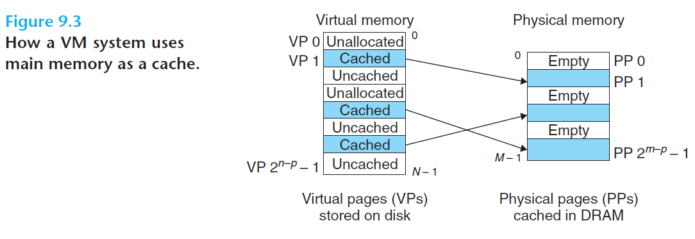
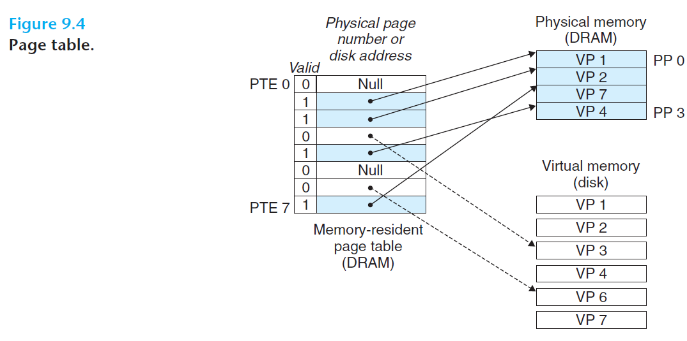
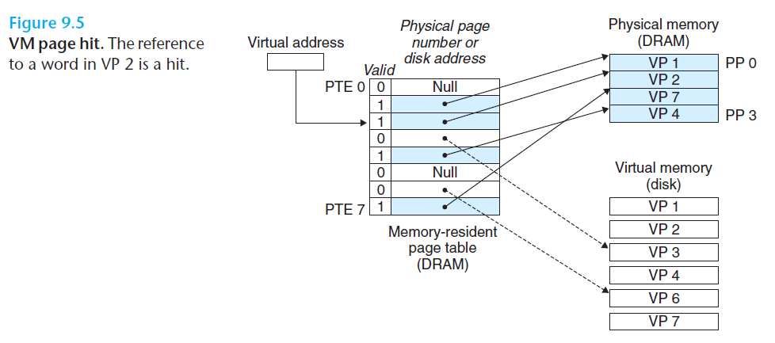
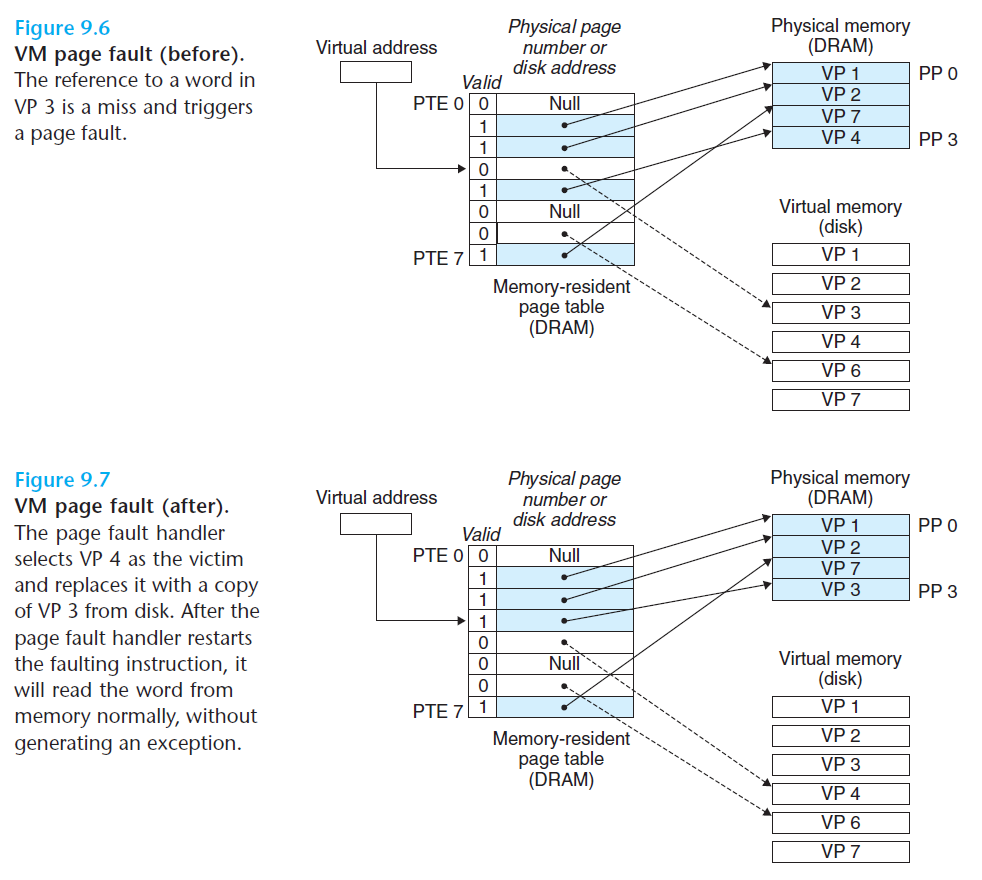
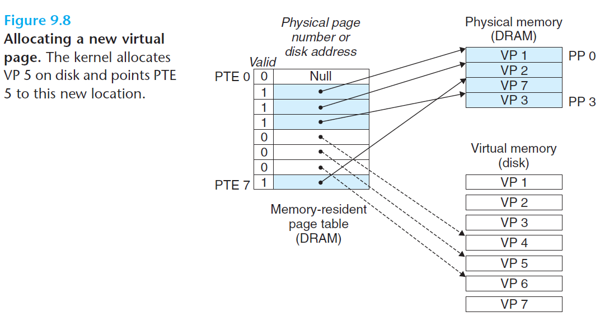

# 9.3 VM as a Tool For Caching

- Conceptually, virtual memory is organized as an array of N contiguous bytes stored on disk
  - Each byte has a unique virtual address
  - The contents of the array on disk are cached in main memory
- Virtual memory is partitioned into fixed-sized *virtual pages (VPs)*
  - Each virtual page is *P = 2^p* bytes in size
- Physical memory is partitioned into *physical pages (PPs)*, also *P* bytes in size
  - Physical pages are also referred to as *page frames*
- Three states of virtual pages:
  - *Unallocated*: not yet allocated (or created) by the VM system
    - Unallocated pages do not have data associated with them, so do not occupy space on disk
  - *Cached*: allocated pages that are currently cached in physical memory
  - *Uncached*: allocated pages that are not cached in physical memory

 

## 9.3.1 DRAM Cache Organization

- *SRAM cache*: L1, L2, and L3 cache memories between CPU and main memory
- *DRAM cache*: VM system's cache that caches virtual pages in main memory
- DRAM has large miss penalty, therefore:
  - Virtual pages tend to be large (typically 4KB to 2MB)
  - DRAM caches are fully associative
  - DRAM caches use very sophisticated replacement algorithms
  - Always use write-back instead of write-through

 

## 9.3.2 Page Tables

- The VM system must have some way of determining if a virtual page is cached in the DRAM, and some way of fetching the virtual page from disk if it is not cached
  - These capabilities are provided by a combination of OS software, address translation hardware in MMU, and the *page table* stored in physical memory
- **Page table** - maps virtual pages to physical pages
- Address translation hardware reads the page table each time it converts a virtual address to a physical address
- A page table is an array of ***page table entries (PTEs)***
  - Each page in the virtual address space has a PTE at a fixed offset in the page table
  - Each PTE has a *valid bit* and an *n*-bit address field
    - If the valid bit is set: the address field indicates the start of the corresponding physical page in DRAM where the virtual page is cached
    - If the valid bit is not set:
      - If the address field is null, indicates the virtual page is unallocated
      - If the address field is not null, it points to the start of the virtual page on disk

 

## 9.3.3 Page Hits

 

- When the requested virtual page is cached in DRAM

 

## 9.3.4 Page Faults

 

- *Page fault* - the requested virtual page is not cached in DRAM
  - MMU will trigger a page fault exception => invokes a page fault exception handler in the kernel, which selects a victim page in DRAM to be replaced by the newly requested page
  - When the handler returns, it restarts the faulting instruction, which would now result in a page hit
- The activity of transferring a page between disk and memory is known as *swapping* or *paging*
- The strategy of waiting till the last moment to swap in a page, when a miss occurs, is known as *demand paging*

 

## 9.3.5 Allocating Pages

 

## 9.3.6 Locality

- The VM system seems inefficient due to the large miss penalties, but it works well due to *locality*
- Locality promises that at any point in time, a program will tend to work on a smaller set of *active pages* known as the *working set* or *resident set*
  - After an initial overhead where the workng set is paged into memory, subsequent references to the working set will result in hits with no additional disk traffic
- Risk of *thrashing*: pages are swapped in and out continuously