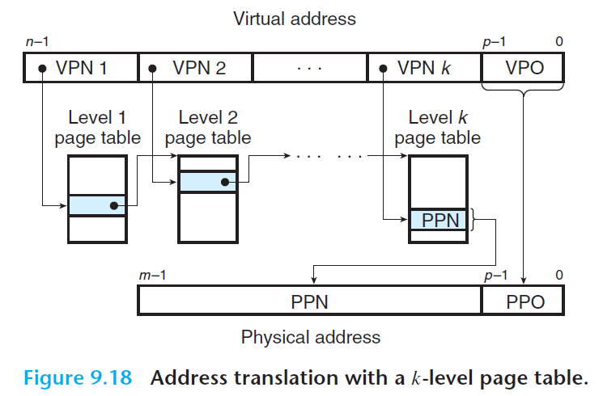

# 9.6 Address Translation

- Address translation - a mapping between the elements of an N-element virtual address space (VAS) and an M-element physical address space (PAS)
- MMU uses the page table to perform this mapping:
  - The *page table base register (PTBR)* points to the page table
  - The n-bit virtual address has two components: a (n-p)-bit *virtual page number (VPN)* and a p-bit *virtual page offset (VPO)*
  - MMU uses the VPN to select the appropriate *page table entry (PTE)* in the page table
  - The corresponding physical address is the concatenation of the *physical page number (PPN)* from the PTE and the VPO from the virtual address
    - Note that the physical page offset (PPO) is identical to the virtual page offset (VPO)

 

### Page Hit and Page Faults

 

**Page hit:**

- *Step 1*: Processor generates a virtual address and sends it to MMU.
- *Step 2*: The MMU generates the PTE address and requests it from the cache/main memory.
- *Step 3*: The cache/main memory returns the PTE to the MMU.
- *Step 4*: The MMU constructs the physical address and sends it to the cache/main memory.
- *Step 5*: The cache/main memory returns the requested data word to the processor.

**Page fault:**

- *Step 1 to 3*: identical as above.
- *Step 4*: The valid bit in the PTE is 0, so the MMU triggers a page fault exception. This transfers control in the CPU to a page fault exception handler in the OS kernel.
- *Step 5*: The fault handler identifies a victim page in physical memory, and if that page has been modified, pages it out to the disk.
- *Step 6*: The fault handler pages in the new page and updates the PTE in memory.
- *Step 7*: The fault handler returns to the original process, causing the faulting instruction to re-execute.
  - The CPU resends the offending virtual address to the MMU. The virtual page is now cached in physical memory, so we are guaranteed a hit.
  - The same steps as page hit above follows.

 

## 9.6.1 Integrating Caches and VM

 

## 9.6.2 Speeding Up Address Translation with a TLB

- The MMU has to refer to a PTE in order to translate VA to PA => this requires an additional fetch of memory, which could take tens to hundreds of clock cycles
  - If the PTE is cached in L1, this reduces cost
  - We can also introduce a small cache of PTEs in the MMU called the *translation lookaside buffer (TLB)*

### Translation Lookaside Buffer (TLB)

- TLB is a small, virtually addressed cache where each line holds a block consisting of a single PTE
  - Usually has a high degree of associativity
- Essentially, TLB caches mappings from *virtual page number* to *physical frame number*

 

### Accessing TLB using Virtual Address

- The set index and tag are extracted from the virtual page number (VPN) in the virtual address
  - If the TLB has `T = 2^t` sets, then the *TLB index (TLBI)* consists of the `t` least significant bits of the VPN
  - The *TLB tag (TLBT)* consists of the remaining bits of the VPN

 

### TLB Hit and TLB Miss

*Note*: All the steps shown here are performed inside the on-chip MMU and are thus fast.

 

**TLB hit:**

- *Step 1*: CPU generates a virtual address.
- *Step 2 and 3*: The MMU fetches the appropriate PTE from the TLB.
- *Step 4*: The MMU translates the VA to PA and sends it to the cache/main memory.
- *Step 5*: The cache/main memory returns the requested data word to the CPU.

**TLB miss:**

- The MMU must fetch the PTE from L1 cache. The newly fetched PTE is stored in the TLB, possibly overwriting an existing entry.

 

## 9.6.3 Multi-Level Page Tables

 

- For a *k*-level page table hierarchy, the virtual address is partitioned into *k* VPNs and a VPO
  - Each VPN *i* is an index into a page table at level *i*

 

- Page table entries:
  - Each PTE in a level *j* table, where level *j* is not the last level, points to the base of some page table at level *j+1*
  - Each PTE in the level *k* table contains either the PPN of some physical page or the address of a disk block.
- To construct the physical address, the MMU must access *k* PTEs before it can determine the PPN
  - This seems expensive, but the TLB caches PTEs from the page tables at different levels
- The PPO is identical to the VPO (as with single-level page tables)