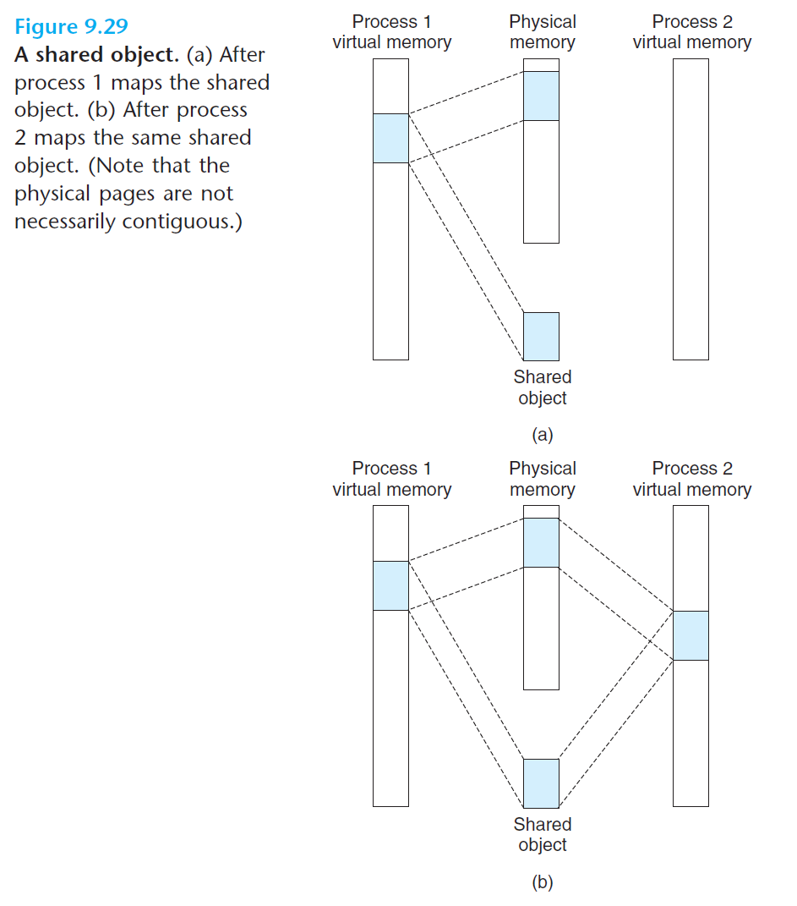
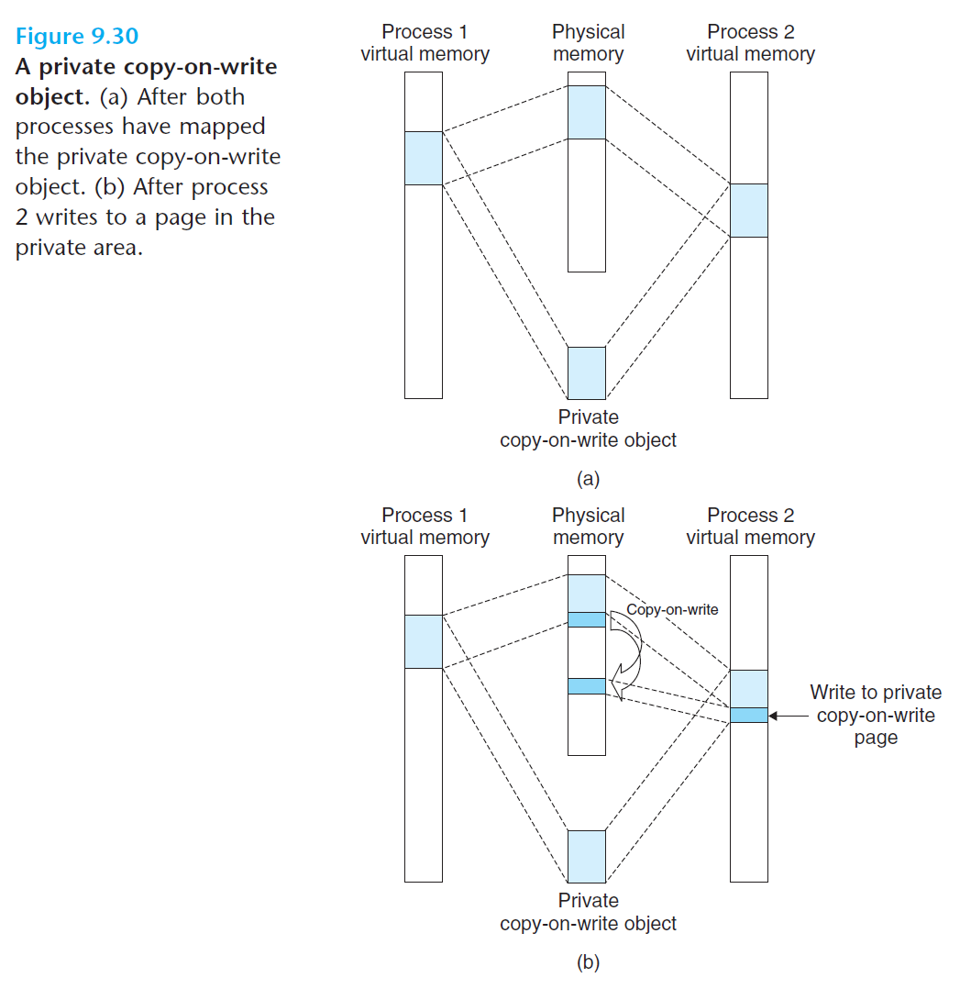
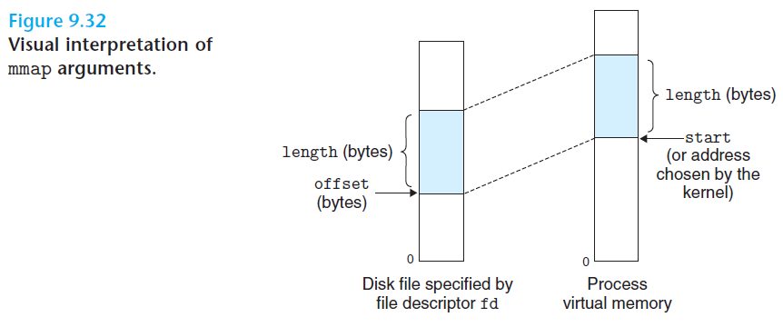

# 9.8 Memory Mapping

- Linux initializes the contents of a virtual memory area by associating it with an *object* on disk - this process is known as ***memory mapping***
- Areas can be mapped to two types of objects:
  - *Regular file in the Linux file system*
  - *Anonymous file* - created by the kernel and contains all binary zeros

<br>

## 9.8.1 Shared Objects Revisited

- Key insight behind memory mapping: if the virtual memory system could be integrated into the conventional file system, then it could provide a simple and efficient way to load programs and data into memory

### Shared Objects

- Why do we need to share data between processes?
  - Many processes have identical read-only code areas
  - They may also need to access identical copies of read-only run-time library code
- Object sharing using *memory mapping*:
  - An object can be mapped into an area of virtual memory as either a *shared object* or a *private object*
    - A virtual memory area into which a shared object is mapped is often called a *shared area*; similarly for *private area*



<br>

- Key point: only a single copy of the shared object needs to be stored in physical memory

### Private Objects

- Private objects are mapped into virtual memory using the technique of **copy-on-write**



<br>

- For each process that maps the private object, the page table entries for the corresponding private area are flagged as *read-only*, and the area struct is flagged as *private copy-on-write*
- When one process attempts to write to some page in the private area, the write triggers a protection fault
  - The fault handler creates a new copy of the page in the physical memory, updates the page table entry to point to the new copy, and restores write permissions to the page
- When the fault handler returns, the write will be re-executed, now on the newly created page
- Why is copy-on-write advantageous?
  - Efficient use of physical memory
  - Fast forking (copy-on-write is used when a parent process forks a child process)

<br>

## 9.8.2 The `fork` Function Revisited

- Forking and copy-on-write:
  - `fork` flags each page in both processes as *read-only*, and flags each area struct in both processes as *private copy-on-write*
  - When either process performs any subsequent writes, the copy-on-write mechanism will create new pages

<br>

## 9.8.3 The `execve` Function Revisitsed

<br>

## 9.8.4 User-Level Memory Mapping with `mmap`

- Linux processes can use `mmap` to create new areas of virtual memory and to map objects to those areas

```c
#include <unistd.h>
#include <sys/mman.h>

void *mmap(void *start, size_t length, int prot, int flags,
            int fd, off_t offset);
// returns pointer to mapped area if OK, MAP_FAILED (-1) on error
```



<br>

- `mmap` asks the kernel to create a new virtual memory area, preferable one that starts at address `start`, and to map a contiguous chunk of the object specified by file descriptor `fd` to the new area. The contiguous chunk has size of `length` and starts at an offset of `offset` from the beginning of the file.
- `start`: just a hint, and is usually specified as `NULL`
- `prot`: the access permissions oft he newly mapped virtual memory area
  - `PROT_EXEC` - pages in the area consist of instructions that may be executed by the CPU
  - `PROT_READ` - pages in the area may be read
  - `PROT_WRITE` - pages in the area may be written
  - `PROT_NONE` - pages in the area cannot be accessed
- `flags`: the type of the mapped object
  - `MAP_ANON` - the backing store is an anonymous object and the corresponding virtual pages are demand-zero
  - `MAP_PRIVATE` - a private copy-on-write object
  - `MAP_SHARED` - a shared object

### `munmap`

- `munmap` deletes regions of virtual memory

```c
#include <unistd.h>
#include <sys/mman.h>

int munmap(void *start, size_t length);
// returns 0 if OK, -1 on error
```

- Deletes the area starting at virtual address `start` and with size `length`
- Subsequent references to the deleted region will result in segmentation faults

<br>
