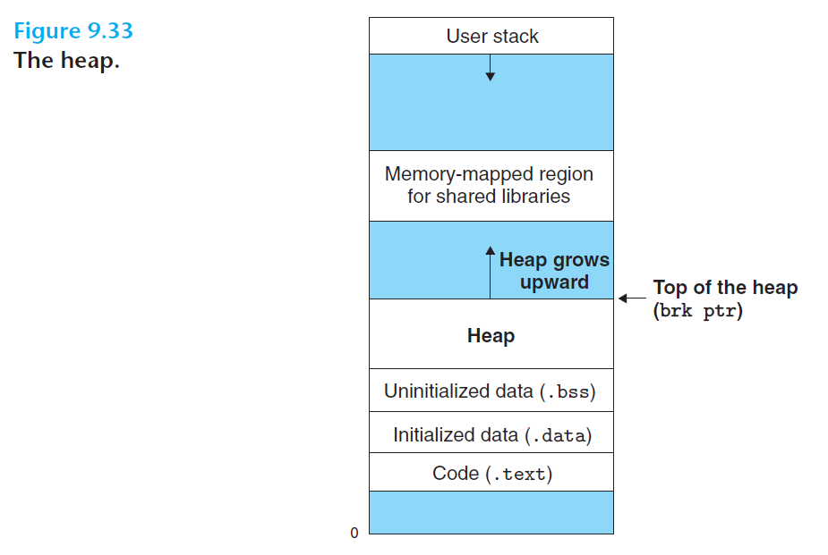
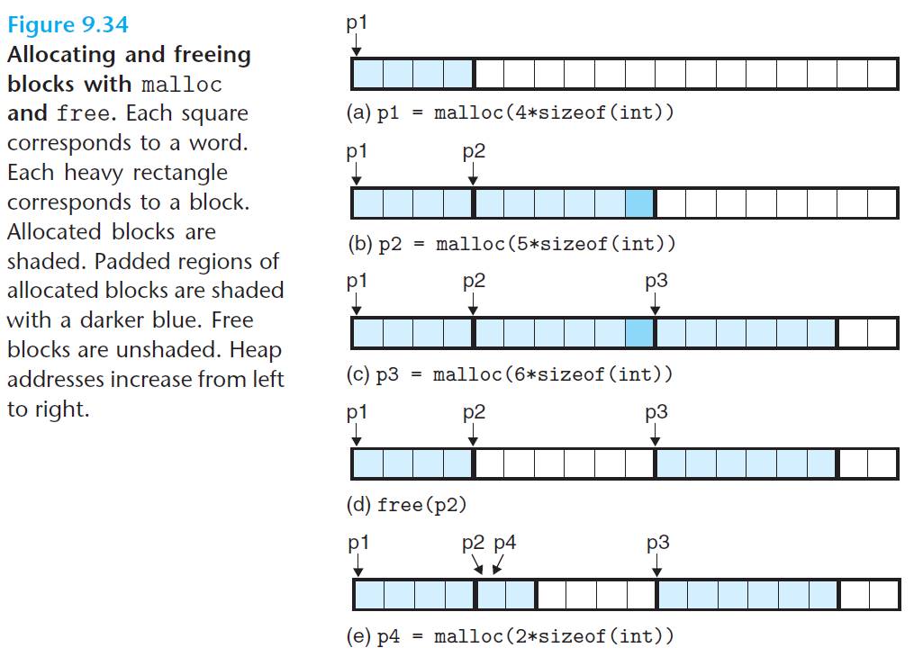
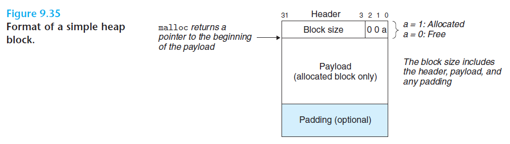
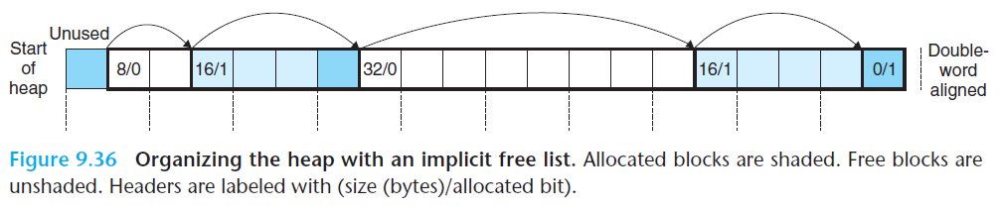
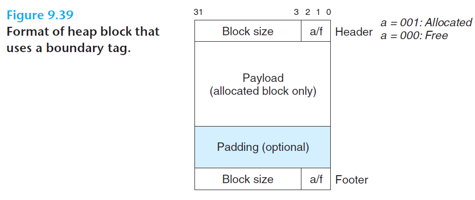

# 9.9 Dynamic Memory Allocation

- ***Dynamic memory allocator*** - maintains an area of a process's virtual memory known as the *heap*
- We may assume that the heap is an area of demand-zero memory that begins immediately after the uninitialized data area and grows upward (toward higher addresses)
  - For each process, the kernel maintains a variable **`brk`** that points to the top of the heap



<br>

- An allocator maintains the heap as a collection of various-size ***blocks***
  - Each block is a contiguous chunk of virtual memory that is either *allocated* or *free*
  - *Allocated* - explicitly reserved for use by application
    - Remains allocated until it is freed, either explicitly by the application or implicitly by the memory allocator
  - *Free* - available to be allocated
- Two styles of allocators:
  - ***Explicit allocators*** - require the application to explicitly free any allocated blocks
    - E.g. `malloc` package in C, or `new` in C++
  - ***Implicit allocators*** - require the allocator to detect when an allocated block is no longer used and then free the block
    - Also known as *garbage collectors*

<br>

## 9.9.1 `malloc` and `free`

### `malloc`

- Explicit allocator
- Provided by the C standard library

```c
#include <stdlib.h>

void * malloc(size_t size);
// returns pointer to allocated block if OK, NULL on error
```

- The returned pointer is suitably aligned for any kind of data object that might be contained in the block
  - 32-bit compilation mode: multiples of 8
  - 64-bit compilation mode: multiples of 16
- `malloc` does not initialize the memory it returns
  - Could use `calloc` to initialize the allocated memory to 0
- `realloc` is used to change the size of a previously allocated block

### Implementation of `malloc`

- Could use `mmap` and `munmap`, but could also use **`sbrk`**:

```c
#include <unistd.h>

void *sbrk(intptr_t incr);
// returns old `brk` pointer on success, -1 on error
```

- `sbrk` grows or shrinks the heap by adding `incr` to the kernel's `brk` pointer

### `free`

- Allocated heap blocks can be freed using `free` function

```c
#include <stdlib.h>

void free(void *ptr);
```

- The `ptr` must point to the beginning of an allocated block that was obtained from `malloc`, `calloc`, or `realloc`
  - If not, the behavior of `free` is undefined



<br>

## 9.9.2 Why Dynamic Memory Allocation?

- Programs often do not know the size of certain data structures until the program actually runs

<br>

## 9.9.3 Allocator Requirements and Goals

<br>

## 9.9.4 Fragmentation

- **Fragmentation** - when otherwise unused memory is not available to satisfy allocate requests
- Two forms of fragmentation:
  - *Internal fragmentation*
  - *External fragmentation*

### Internal Fragmentation

- ***An allocated block is larger than the requested payload***
- Causes:
  - The implementation of an allocator may impose a minimum size on allocated blocks that is greater than the requested payload
  - The allocator may also increase the block size to satisfy alignment constraints
- The amount of internal fragmentation depends only on the pattern of previous requests and the allocator implementation

### External Fragmentation

- ***There is enough aggregate free memory to satisfy a request, but no single free block is large enough to handle the request***
- The amount of external fragmentation depends on not only the pattern of previous requests and the allocator implementation, but also on the pattern of future requests
- To resolve this issue, allocators typically attempt to maintain small numbers of large free blocks rather than large numbers of smaller free blocks

<br>

## 9.9.5 Implementation Issues

- A practical allocator must consider the following issues:
  - *Free block organization*: How do we keep track of free blocks?
  - *Placement*: How do we choose an appropriate free block in which to place a newly allocated block?
  - *Splitting*: After we place a newly allocated block in some free block, what to do with the remainder of the free block?
  - *Coalescing*: What to do with a block that has just been freed?

<br>

## 9.9.6 Implicit Free Lists

- We need to track block boundaries and distinguish between allocated and free blocks
  - Most allocators embed this information in the blocks themselves, as shown below



<br>

- In the above diagram, the block consists of a one-word *header*, the *payload*, and possibly some more *padding*
  - *Header*: block size, whether the block is allocated or freed (the *allocated bit*)
- This results in the heap as below:
  - Rectangular boxes: allocated blocks
  - Dark shaded: padding
  - Not shaded: free blocks



<br>

- This organization is known as ***implicit free list***, because the free blocks are implicitly linked by the size fields of headers
  - The allocator can indirectly traverse all free blocks by traversing all of the blocks in the heap
- Advantage: simplicity
- Disadvantage: linear cost of traversing the total number of allocated and free blocks in the heap
- Also note that the system's alignment requirement imposes a *minimum block size* on the allocator

<br>

## 9.9.7 Placing Allocated Blocks

- ***Placement policy*** - determines how the allocator searches for a free block large enough to hold the requested block
  - *First fit*: searches the free list from the beginning, chooses the first one that fits
    - Advantage: tends to retain large free blocks at the end of the list
    - Disadvantage: tends to leave "splinters" of small free blocks toward the beginning of the list, which increases search time for larger blocks
  - *Next fit*: starts the search at where the previous search left off, chooses the first one that fits
    - Motivated by the idea that if we found a fit in some free block the last time, there is a good chance that we will find a fit the next time in the remainder of the block
    - Disadvantage: worse memory utilization than first fit
  - *Best fit*: examines every free block, chooses the block with the smallest size that fits
    - Advantage: better memory utiliaztion than both of the above policies
    - Disadvantage: requires an exhaustive search of the heap

<br>

## 9.9.8 Splitting Free Blocks

- Once the allocator has located a free block that fits, it must decide *how much of the free block to allocate*
- *Use entire free block*:
  - Advantage: simple, fast
  - Disadvantage: introduces internal fragmentation
- *Split* the free block into two parts:
  - The first part becomes the allocated block
  - The remainder becomes a new free block

<br>

## 9.9.9 Getting Additional Heap Memory

- What happens if the allocator cannot find a fit for the requested block?
  - *Solution 1*: *coalescing* free blocks that are physically adjacent in memory
  - *Solution 2*: allocator asks the kernel for additional heap memory by calling `sbrk`
    - The additional memory then becomes one large free block, inserted into the free list

<br>

## 9.9.10 Coalescing Free Blocks

- ***False fragmentation*** - when the avaialble free memory is chopped up into small, unusable free blocks
  - This occurs when the allocator frees an allocated block, but there are other free blocks adjacent to the newly freed block
- The allocator needs to merge adjacent free blocks in a process known as ***coalescing***
- Coalescing policies:
  - *Immediate coalescing*: merging adjacent blocks each time a block is freed
    - Advantage: straightforward, constant-time
    - Disadvantage: thrashing - a block is repeatedly coalesced and then split soon afterwards
  - *Deferred coalescing*: wait to coalesce at some later time, like until some allocation request fails

<br>

## 9.9.11 Coalescing with Boundary Tags

- Refer to the block we want to free as *current block*
- Coalescing the next free block: straightforward, constant-time
  - Head of the current block points to the header of the next block, which can be checked to determine if the next block is free
  - If it is free, we add its size to the size of the current header
- Coalescing the previous free block:
  - Would require linear time to find the header of the previous block
  - *Alternative*: introducing ***boundary tags/footer***
    - Add a footer to the end of each block, which is a replica of the header
    - We can now examinine the footer of the previous block, which is always right before the header of the current block



<br>